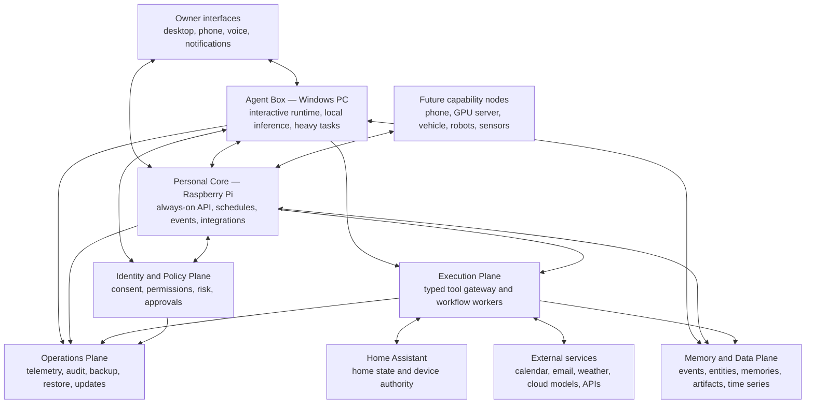

# Osun: Living Master Plan

**Document status:** Living specification  
**Version:** 0.1.11 \
**Last updated:** 2026-07-26
**Planning horizon:** 2026-2036+  
**Initial operator:** One person with AI development assistance  
**Human capacity assumption:** 10 focused hours per week (about 43 hours per month, 520 hours per year, and 5,200 hours over ten years if sustained)  
**System scope:** Single-user first; household and family support only after privacy isolation and consent controls are proven  

---

## 1. How to use and change this plan

This file is Osun's editable source of truth. It is a plan, not a promise. Dates are planning ranges; completion is determined by evidence-based exit gates.

Update it whenever the mission, constraints, evidence, or priorities change. Use semantic document versions:

- **Patch** (`0.1.0` to `0.1.1`): clarification, status update, or corrected assumption.
- **Minor** (`0.1` to `0.2`): changed milestone, requirement, metric, or architectural decision.
- **Major** (`0.x` to `1.0`): changed mission, trust model, or system boundary.

Every material change should update the decision log near the end of this file. A decision should include the date, reason, evidence, consequences, and conditions that would cause it to be reconsidered. Architecture Decision Records can be split into separate files once implementation begins.

Review cadence:

- **Weekly:** update active work, evidence, blockers, and next actions.
- **Monthly:** reassess scope, system health, time use, and the next milestone gate.
- **Quarterly:** test restore procedures, review risks, remove unused features, and revise the roadmap.
- **Annually:** revisit the mission, autonomy boundaries, hardware topology, model strategy, and long-range assumptions.

Status vocabulary:

- **Proposed:** plausible but not yet accepted.
- **Accepted:** approved direction; may not yet be built.
- **In progress:** actively being implemented or evaluated.
- **Verified:** exit gate passed with recorded evidence.
- **Superseded:** intentionally replaced, with the replacement linked.

---

## 2. Executive intent

Osun will become a durable, local-first personal intelligence system that helps its owner live deliberately across work, health, learning, relationships, home, responsibilities, and recreation. It will gather only authorized data, preserve a reviewable history, learn preferences and patterns, coordinate tools and devices, and offer timely assistance without taking control away from its owner.

The central product is not a chatbot or a single model. It is a portable body of personal intelligence:

```text
personal history
+ explicit memories and their provenance
+ people, places, projects, and relationships
+ preferences, values, boundaries, and goals
+ reusable skills and workflows
+ feedback and outcome data
+ evaluation cases and safety policies
= an owner-controlled personal intelligence asset
```

Foundation models, databases, hardware, and vendors will change. Osun's contracts and personal data must survive those changes.

### 2.1 North-star outcome

Osun is successful when it repeatedly helps the owner make or carry out better decisions, saves meaningful time, reduces avoidable cognitive load, and supports stated values—while remaining understandable, reversible, private, reliable, and easy to stop.

The system must never infer that frequently observed behavior is automatically desirable. It must distinguish:

- what happened;
- what Osun inferred;
- what the owner prefers;
- what the owner aspires to change;
- what Osun is allowed to do.

### 2.2 What “PhD/enterprise grade” means here

It does not mean maximizing complexity. It means that important claims and changes are supported by evidence, and that the system can be understood and operated under failure.

The standard is:

- explicit research questions and falsifiable hypotheses;
- reproducible experiments and versioned datasets;
- documented provenance, uncertainty, and limitations;
- measured baselines and regression tests;
- threat modeling and privacy analysis before broad data collection;
- typed, versioned interfaces between components;
- least privilege, defense in depth, and auditable actions;
- backup, restore, migration, and rollback procedures;
- service objectives based on the user experience;
- written decisions and periodic architectural review;
- honest separation between correlation, prediction, and causation.

Osun will use the structure of the [NIST AI Risk Management Framework](https://www.nist.gov/itl/ai-risk-management-framework) for AI governance, the [NIST Privacy Framework](https://www.nist.gov/privacy-framework) for privacy risk, the [NIST Cybersecurity Framework 2.0](https://www.nist.gov/news-events/news/2024/02/nist-releases-version-20-landmark-cybersecurity-framework) for cybersecurity, and the [NIST Secure Software Development Framework](https://csrc.nist.gov/projects/ssdf) for development practice. These are reference profiles rather than certifications.

### 2.3 Explicit non-goals

Until separately approved and engineered, Osun is not:

- a medical device, clinician, therapist, lawyer, fiduciary, or emergency responder;
- the authority for smoke alarms, security alarms, locks, vehicles, life-support equipment, or other safety-critical systems;
- authorized to move money, enter contracts, impersonate the owner, or make irreversible commitments independently;
- a covert surveillance system for family, guests, neighbors, coworkers, or the public;
- an optimization system whose inferred metric overrides the owner's expressed judgment;
- dependent on one AI provider, one model family, or one hardware node;
- allowed to train directly on every captured datum without data review and purpose limitation.

---

## 3. Assumptions and constraints

These assumptions are accepted for planning and may be edited at any time.

| ID | Assumption | Current position | Revisit when |
|---|---|---|---|
| A-01 | Primary owner | One adult owner | A second person is invited |
| A-02 | Human capacity | 10 focused hours/week | Sustained variance exceeds 25% for 8 weeks |
| A-03 | AI capacity | AI can draft, code, test, research, and document until session/token limits | Cost, reliability, or provider constraints change |
| A-04 | Agent Box | Windows PC provides interactive and compute-heavy work | A dedicated GPU/server is justified |
| A-05 | Personal Core | Raspberry Pi provides always-on lightweight coordination | Capacity or reliability data shows it is insufficient |
| A-06 | Home control | Home Assistant remains the device authority | A missing use case cannot be met safely |
| A-07 | Data posture | Local-first, with optional explicitly routed cloud processing | Privacy policy is decided differently |
| A-08 | Network posture | No direct public exposure by default | A reviewed remote-access design is accepted |
| A-09 | Product strategy | Private single-user research system first | Distribution or commercialization becomes a goal |
| A-10 | Schedule | Gates control progress; dates are ranges | External deadlines appear |

### 3.1 Capacity model

At ten hours per week, human attention—not AI generation—is the critical resource. AI may create more code than the owner can safely review. Therefore:

- no more than two work items are in progress at once;
- one meaningful vertical slice is preferred to several unfinished components;
- every AI-generated change must have acceptance criteria and automated checks;
- consequential code requires owner review before deployment;
- 20–30% of human time is reserved for testing, documentation, security, and maintenance;
- every fourth or fifth week may be used for consolidation rather than new capability;
- a feature that permanently raises maintenance cost must justify that cost.

Default weekly allocation:

| Activity | Hours | Purpose |
|---|---:|---|
| Product and implementation | 5 | Build one bounded vertical slice |
| Testing and evaluation | 2 | Regression, scenario, and adversarial tests |
| Architecture, security, and documentation | 1.5 | Keep the system understandable |
| Operations and maintenance | 1 | Updates, backups, incidents, dependency care |
| Review and next-week planning | 0.5 | Evidence, decisions, and backlog |

AI can work in parallel on research, scaffolding, test generation, documentation, code review, migration scripts, and analysis. It must not silently expand scope or promote its own output into production.

---

## 4. Product principles

1. **Local-first, not dogmatically local-only.** Private data and core functions should remain available locally. Cloud services may be used when explicitly allowed and measurably beneficial.
2. **Models are replaceable; personal intelligence is durable.** Memory, policy, workflows, evaluations, and provenance live outside model weights.
3. **Policy stands between reasoning and action.** The model proposes; a deterministic gateway validates identity, permission, risk, schema, limits, and approvals.
4. **Facts are not inferences.** Raw observations, derived claims, preferences, predictions, and goals remain distinguishable.
5. **Every meaningful action is attributable.** The owner can see what acted, why, with which inputs and permissions, and what actually happened.
6. **Verification completes an action.** A sent command is not a successful outcome until the target state is confirmed or failure is recorded.
7. **Autonomy is earned by domain.** Reliability in calendar suggestions does not authorize home access or financial actions.
8. **The owner can inspect, correct, forget, export, pause, and roll back.** These are core capabilities, not administrative extras.
9. **Proactivity has an interruption budget.** Timeliness, confidence, benefit, and attention cost are evaluated together.
10. **Safety-critical systems retain their own authority.** Osun may coordinate with purpose-built systems but does not replace their safeguards.
11. **Privacy boundaries precede household features.** Shared life does not imply shared access to all data.
12. **Use boring infrastructure until evidence requires sophistication.** Modularity comes from contracts and tests, not an early swarm of services.

---

## 5. Target end-to-end architecture

### 5.1 Trust zones and responsibilities



Network location alone never grants trust. Each user, service, agent, device, and workflow receives an identity and only the permissions it needs, following the resource- and identity-centered approach described in [NIST SP 800-207 Zero Trust Architecture](https://www.nist.gov/news-events/news/2020/08/zero-trust-architecture-nist-publishes-sp-800-207).

### 5.2 Major components

| Component | Responsibility | Must not own |
|---|---|---|
| Experience layer | Chat/command interface, timeline, approvals, memory controls, briefings | Policy decisions or direct device credentials |
| Agent runtime | Interpret goals, retrieve context, plan, choose skills, monitor work | Unrestricted tools, secrets, or silent permission changes |
| Context builder | Assemble minimum relevant context with citations and sensitivity filtering | Permanent truth or policy authority |
| Model router | Select local/cloud model based on task, sensitivity, latency, quality, and cost | Memory or tool authorization |
| Workflow engine | Persist deterministic and agentic multi-step work; recover after restart | Bypassing the policy gateway |
| Scheduler | Time-based and deferred triggers | Semantic interpretation of unsafe actions |
| Event bus/log | Normalize, sequence, route, replay, and correlate events | Treating all external data as trusted |
| Tool gateway | Validate typed calls, enforce permission and limits, execute, verify, audit | Open-ended model interpretation |
| Identity service | Identify users, services, nodes, agents, and delegated authority | Assuming network presence equals identity |
| Policy engine | Risk classification, consent, approval, data-use and retention rules | Generating goals or persuasive content |
| Memory service | Store and retrieve versioned facts, episodes, preferences, procedures, and links | Hiding provenance or making irreversible inferences |
| Artifact store | Original files, recordings, exports, and derived artifacts | Serving unfiltered sensitive data to every component |
| Time-series store | Numeric observations and trends | Replacing original source records when provenance matters |
| Learning pipeline | Build approved datasets, train candidates, evaluate, shadow, promote or roll back | Self-modifying production behavior without gates |
| Operations plane | Structured logs, metrics, traces, alerts, backups, updates, incident records | Collecting unnecessary personal content in telemetry |
| Home Assistant adapter | Translate approved Osun requests into HA actions and subscribe to authorized state | Reimplementing Home Assistant's device model |

Home Assistant should remain a peer subsystem and device authority. Its architecture already separates Core, integrations, and device/service interactions; Osun should integrate through supported APIs and events rather than duplicate that responsibility. See the [Home Assistant architecture overview](https://developers.home-assistant.io/docs/architecture_index/) and [integration architecture](https://developers.home-assistant.io/docs/architecture_components/).

### 5.3 The standard Osun transaction

```mermaid
flowchart LR
    A["Capture<br/>request or event"] --> B["Authenticate<br/>actor and source"]
    B --> C["Normalize<br/>typed event"]
    C --> D["Retrieve<br/>minimum relevant context"]
    D --> E["Plan<br/>rules plus model"]
    E --> F["Evaluate policy<br/>risk, consent, approval"]
    F --> G["Execute<br/>typed tool or workflow"]
    G --> H["Verify<br/>target outcome"]
    H --> I["Record<br/>event, action, evidence"]
    I --> J["Learn<br/>candidate memory or feedback"]
    J --> K["Review<br/>promote, correct, expire"]
```



No stage is allowed to erase the distinction between observation, decision, action, outcome, and learning.

### 5.4 Stable contracts

Long-term cohesion depends on a small number of versioned contracts.

#### Event envelope

Use a CloudEvents-compatible shape where practical; [CloudEvents](https://cloudevents.io/) exists to standardize event description across publishers and platforms.

Minimum conceptual fields:

```yaml
spec_version: string
event_id: uuid
event_type: namespaced.string
schema_version: semver
occurred_at: timestamp
received_at: timestamp
source: service_or_device_identity
subject: entity_reference
actor: person_service_or_agent_reference
correlation_id: uuid
causation_id: uuid_or_null
sensitivity: public|personal|sensitive|restricted
retention_class: policy_reference
provenance: source_evidence_references
payload: typed_object_or_artifact_reference
```

#### Tool contract

```yaml
tool_name: namespaced.action
version: semver
input_schema: reference
output_schema: reference
required_scopes: list
risk_class: R0_to_R4
approval_policy: reference
idempotency_required: boolean
timeout: duration
rate_limit: policy
reversibility: reversible|compensatable|irreversible
verification_method: reference
data_egress_class: none|local|approved_external
```

#### Memory record

```yaml
memory_id: uuid
memory_type: observation|fact|preference|goal|episode|procedure|prediction
subject: entity_reference
statement: structured_claim
valid_time: interval
recorded_time: timestamp
confidence: calibrated_probability_or_band
status: candidate|confirmed|disputed|expired|deleted
sensitivity: classification
provenance: evidence_and_derivation_graph
supersedes: memory_id_or_null
retention_policy: reference
allowed_uses: list
```

The provenance model should be compatible in spirit with the W3C distinction among entities, activities, and agents in [PROV-O](https://www.w3.org/TR/prov-o/).

#### Action ledger record

Every attempted action records the request, planner/model version, context references, applicable policy version, approval, normalized tool call, execution result, verification evidence, latency, cost, and any compensating action.

### 5.5 Memory architecture

Osun will not use “a vector database” as a synonym for memory. It needs complementary stores and a single memory API:

| Memory form | Purpose | Typical query |
|---|---|---|
| Immutable event history | What was observed or attempted | “What happened last Tuesday?” |
| Entity graph | People, places, projects, devices, relationships | “Which project is this appointment related to?” |
| Versioned fact store | Current and historical claims | “What is my current preferred work window?” |
| Episodic summaries | Coherent periods and experiences | “What did I learn during the move?” |
| Procedure library | Reusable workflows and checklists | “How do I normally prepare for travel?” |
| Document/artifact store | Original source material | “Show the receipt this amount came from.” |
| Semantic index | Candidate retrieval across language | “Find relevant memories even if wording differs.” |
| Time-series store | Numeric behavior and environment | “How has sleep related to afternoon focus?” |
| Feedback/evaluation store | Outcomes and labeled examples | “Which planner version helped most?” |

Retrieval-augmented generation combines parametric models with explicit non-parametric memory and improves updateability and provenance relative to relying only on model weights; the original approach is described by Lewis et al. in [Retrieval-Augmented Generation for Knowledge-Intensive NLP Tasks](https://papers.neurips.cc/paper_files/paper/2020/hash/6b493230205f780e1bc26945df7481e5-Abstract.html). Long-term memory evaluation must include extraction, temporal reasoning, updates, multi-session reasoning, and abstention, as emphasized by [LongMemEval](https://arxiv.org/abs/2410.10813).

Memory lifecycle:

1. Ingest an authorized observation without rewriting the source.
2. Normalize identity, time, sensitivity, and provenance.
3. Generate zero or more candidate interpretations.
4. Merge only under explicit conflict and confidence rules.
5. Retrieve with temporal and access-policy filters.
6. Present source evidence when a memory influences a decision.
7. Permit correction, dispute, expiration, purpose restriction, and deletion.
8. Verify deletion across indexes, replicas, caches, exports, and future training sets.

### 5.6 Personal learning architecture

Continuous learning happens first through memory and feedback, not immediate weight updates.

Learning layers:

| Layer | Examples | Update policy |
|---|---|---|
| Explicit state | Goals, boundaries, declared preferences | Immediate after confirmation |
| Derived memory | Patterns, routines, inferred preferences | Candidate first; confidence and expiration required |
| Small predictors | Task duration, interruption timing, ranking | Periodic retraining with holdout evaluation |
| Retrieval/ranking | Which memories and procedures matter | Offline evaluation and shadow deployment |
| Model adapters | Tone, terminology, recurring reasoning style | Delayed until sufficient curated data |
| Foundation models | General reasoning capability | Replaced or upgraded; not trained from scratch on one person |

Production models never rewrite themselves after each interaction. Candidate training follows:

```text
approved signals → versioned dataset → candidate training → offline evaluation
→ adversarial tests → shadow mode → owner review → canary → promote or rollback
```

Continual training must explicitly test for regression and catastrophic forgetting, a known risk in sequential neural-network training documented by Kirkpatrick et al. in [Overcoming catastrophic forgetting in neural networks](https://doi.org/10.1073/PNAS.1611835114). Parameter-efficient adapters such as [LoRA](https://openreview.net/pdf?id=nZeVKeeFYf9) may later be useful, but adapters never replace explicit, correctable memory.

### 5.7 Autonomy and risk classes

| Class | Meaning | Examples | Default rule |
|---|---|---|---|
| R0 | Read-only or internal computation | Search local notes, summarize approved document | May run automatically within data policy |
| R1 | Suggestion or prepared draft | Propose schedule, draft message | Show owner; no external effect |
| R2 | Low-impact reversible action | Add personal reminder, adjust noncritical light | Allow only in approved workflows with undo |
| R3 | Consequential or externally visible action | Send message, create appointment, unlock door | Explicit just-in-time approval and strong verification |
| R4 | Prohibited or specialized high risk | Move money, prescribe treatment, disable alarm | Not allowed without a future separately engineered authority model |

Risk is contextual. Turning on a light may be R2 normally but higher risk if it reveals occupancy or affects sleep. The policy engine evaluates actor, subject, data, location, time, workflow, tool, and potential consequence.

### 5.8 Observability and audit

Operational telemetry should use vendor-neutral structured traces, metrics, and logs. [OpenTelemetry](https://opentelemetry.io/docs/) provides a standard model for these signals and correlation across distributed components.

Rules:

- application logs are structured and schema-versioned;
- personal content is excluded or redacted by default;
- correlation IDs connect request, workflow, tool call, and outcome;
- security audit records are append-only and protected from ordinary application modification;
- latency, availability, error rate, model/tool cost, approval wait, retrieval quality, and queue depth are measurable;
- traces can explain slow workflows without exposing unnecessary memory content;
- retention differs for operations, security, product analytics, and personal history.

---

## 6. Research program

Osun is a longitudinal single-person research system. It can produce strong within-person evidence while being cautious about generalization.

### 6.1 Research questions

| ID | Research question | Initial hypothesis | Primary evidence |
|---|---|---|---|
| RQ-01 | Which memory representation produces trustworthy long-term recall? | Hybrid temporal, structured, and semantic retrieval will outperform conversational history alone | Personal memory benchmark; precision, recall, citation accuracy, abstention |
| RQ-02 | When does proactive assistance help rather than distract? | Confidence plus context plus an interruption budget will outperform fixed reminders | Acceptance, dismissal, completion, interruption regret, time-to-value |
| RQ-03 | How much autonomy is beneficial in each domain? | Domain-specific earned autonomy will outperform a global autonomy setting | Error severity, reversals, approval burden, trust surveys |
| RQ-04 | Which signals best capture personal preference? | Explicit edits and verified outcomes are more reliable than passive behavior alone | Ranking accuracy and longitudinal stability |
| RQ-05 | When does model adaptation add value beyond memory and prompting? | Small ranking/prediction models will add value earlier than language-model fine-tuning | Controlled comparisons against fixed-model baselines |
| RQ-06 | How should Osun represent personal change? | Temporally scoped preferences plus stated goals will avoid fossilizing outdated behavior | Conflict/update tests and owner correction rate |
| RQ-07 | What creates justified trust? | Explanations with evidence, preview, undo, and reliable recovery will matter more than maximum autonomy | Trust calibration, override rate, incident response results |

### 6.2 Experimental method

For each material experiment:

1. State the decision the experiment will inform.
2. Define the hypothesis, baseline, intervention, population/context, and stopping rule.
3. Choose metrics before observing results.
4. Separate offline replay, shadow evaluation, and live intervention.
5. Version code, prompts, models, datasets, policies, and environment.
6. Record failures and excluded cases.
7. Report uncertainty and plausible alternative explanations.
8. Decide: adopt, reject, repeat, or gather more data.

For personal interventions, prefer reversible N-of-1 designs such as alternating periods or randomized prompt timing when ethical and practical. Do not claim causation from simple behavioral correlation. Health-related experiments require conservative wording and, when appropriate, professional guidance.

### 6.3 Evaluation suites

Maintain separate suites:

- **Contract suite:** schemas and compatibility across component versions.
- **Golden workflow suite:** deterministic end-to-end cases with expected effects.
- **Personal memory suite:** facts, time, updates, conflicts, multi-session reasoning, deletion, and abstention.
- **Model behavior suite:** correctness, groundedness, uncertainty, refusal, and format adherence.
- **Agent safety suite:** prompt injection, tool confusion, permission escalation, data exfiltration, and unsafe chaining.
- **Privacy suite:** data minimization, access boundaries, export, correction, expiration, and verified deletion.
- **Resilience suite:** power loss, restart, duplicated events, network partition, full disk, corrupt record, unavailable model, and unavailable service.
- **Human factors suite:** useful timing, cognitive burden, clarity of approval, undo comprehension, and notification fatigue.

Each production release records the exact suite versions and results.

### 6.4 System metrics

Metrics guide investigation; they are not targets to game.

| Dimension | Examples |
|---|---|
| Utility | Hours saved, tasks completed, useful suggestions, avoided rework |
| Quality | Correctness, groundedness, workflow success, retrieval precision/recall |
| Safety | Unauthorized action count, harmful near misses, policy blocks, reversal success |
| Trust | Owner confidence calibration, corrections, overrides, unexplained-action count |
| Attention | Notifications sent, acted on, dismissed, snoozed, and later regretted |
| Reliability | Availability, queue delay, p50/p95 latency, recovery time, data loss |
| Privacy | Sensitive egress, access denials, deletion verification, consent coverage |
| Maintainability | Weekly care time, dependency age, failed upgrades, restore rehearsal time |
| Cost | Hardware, energy, subscriptions, model calls, storage, maintenance hours |

The top-level outcome review is qualitative as well as quantitative: “Did Osun support the life I intended to live this period?”

---

## 7. Security, privacy, and governance baseline

### 7.1 Primary threats

- Prompt injection embedded in email, web pages, documents, device names, or tool output.
- A model inventing tool arguments or chaining individually safe actions into an unsafe outcome.
- Credential exposure through prompts, logs, traces, memory, crash dumps, or backups.
- Malicious or faulty integration poisoning memory or emitting false events.
- Compromised PC, Pi, phone, home device, dependency, container, or model artifact.
- Lateral movement from an IoT network into personal data services.
- Replay, duplication, race conditions, and confused-deputy authorization.
- Silent policy drift or a workflow retaining permissions after its purpose ends.
- Sensitive data sent to an unapproved cloud model or external service.
- Cross-person memory leakage after household support is introduced.
- Training-data contamination, model regression, and extraction of memorized private data.
- Overreliance on persuasive but incorrect advice.
- Loss, theft, fire, power failure, storage corruption, and unavailable vendors.

The agent threat model will be updated with the [OWASP Agentic AI Security Initiative](https://genai.owasp.org/initiatives/agentic-security-initiative/), especially for multi-step tool use and external context.

### 7.2 Required controls by the end of year one

- Service and device identities; no anonymous internal administrative APIs.
- Least-privilege scopes and short-lived credentials where supported.
- Secrets held outside source code, prompts, and ordinary logs.
- Default-deny network exposure and explicit egress rules.
- Typed tool schemas, argument validation, allowlists, rate limits, timeouts, and idempotency keys.
- Separate read, propose, approve, execute, verify, and administer permissions.
- Sandboxed processing for untrusted files and generated code.
- Content-origin labels so external text cannot masquerade as system instruction.
- Encrypted transport and encrypted sensitive storage.
- Signed or verified artifacts, dependency inventory, and vulnerability update process.
- Immutable or tamper-evident security/audit records.
- Automated backups plus tested restore.
- Emergency pause/kill switch that does not depend on the agent model.
- Incident checklist and owner notification path.

### 7.3 Privacy rights implemented as product features

The owner can:

- see categories and sources of collected data;
- see which workflows and models used a datum;
- inspect why a memory is believed;
- correct or dispute a memory without erasing the original audit trail;
- limit data to specified purposes;
- set retention and expiration by category;
- delete data and verify deletion propagation;
- export data in documented, machine-readable formats;
- pause collection globally or by source;
- see every external data transfer and its purpose.

Before multi-person support, each person receives independent identity, private space, shared-space rules, and consent controls. Household membership never grants blanket access.

### 7.4 Data classification

| Class | Examples | Default handling |
|---|---|---|
| Public | Public manuals, public weather | Normal local processing; external use permitted by policy |
| Personal | Tasks, preferences, home routines | Local-first; controlled external processing |
| Sensitive | Health, finances, private communications, precise location | Encrypted, minimized, explicit purpose and egress approval |
| Restricted | Credentials, recovery keys, intimate data, third-party secrets | Never exposed to general models; specialized vault and policy |

### 7.5 Incident severity

| Severity | Example | Response objective |
|---|---|---|
| SEV-1 | Physical harm risk, credential compromise, major private-data exposure | Stop affected automation immediately; preserve evidence; owner response now |
| SEV-2 | Unauthorized external action or broad service failure | Disable affected workflow; investigate same day |
| SEV-3 | Incorrect memory influencing decisions or repeated workflow failure | Quarantine data/workflow; fix before further use |
| SEV-4 | Minor defect with safe workaround | Backlog and track |

---

## 8. Engineering and operating model

### 8.1 Work hierarchy

```text
mission → outcomes → milestones → capabilities → vertical slices → tasks → evidence
```

A vertical slice starts with an owner-visible trigger and ends with a verified outcome and audit record. Infrastructure without a near-term slice is minimized.

### 8.2 Definition of ready

A work item is ready when it has:

- a user or operational outcome;
- scope and explicit non-scope;
- risk classification and data categories;
- acceptance criteria;
- test/evaluation approach;
- rollback or recovery plan;
- estimated human review burden.

### 8.3 Definition of done

A capability is done only when:

- acceptance criteria pass;
- code and configuration are versioned;
- automated unit, contract, and relevant end-to-end tests pass;
- security and privacy impacts are reviewed;
- logs, metrics, and audit coverage exist;
- failure behavior and timeout are defined;
- documentation and operator procedure are current;
- backup/migration implications are addressed;
- the owner can disable or roll it back;
- evidence is linked from the milestone record.

### 8.4 Release model

- Local development and test environment.
- Staging/simulation environment with synthetic data.
- Shadow mode for agentic or proactive behavior.
- Canary enablement for one workflow or narrow context.
- Explicit production promotion.
- Versioned rollback for application, configuration, policy, prompt, workflow, model, and adapter.

### 8.5 Repository structure target

This is a future structure, not an instruction to create all directories immediately:

```text
docs/
  OSUN_MASTER_PLAN.md
  architecture/
  decisions/
  research/
  runbooks/
contracts/
  events/
  tools/
  memory/
services/
apps/
workflows/
skills/
policies/
evals/
infra/
scripts/
tests/
```

### 8.6 Technical decision policy

Do not select a component merely because it is popular or “AI native.” For each durable dependency, compare:

- functional fit;
- operational burden for one person;
- offline behavior;
- performance on actual target hardware;
- security history and update process;
- data portability and migration path;
- observability and testability;
- community/project health;
- license and expected ten-year survivability;
- replacement cost.

Major choices requiring written decisions include programming language, data stores, event transport, workflow engine, local model runtime, model provider routing, authentication, secrets, remote access, backup destination, observability stack, and Home Assistant integration path.

---

## 9. Milestone roadmap

The roadmap is gate-based. If an exit gate is not met, the next milestone does not inherit the missing capability. Dates assume an average of ten human hours each week and responsible use of AI assistance.

### 9.1 Summary

| Milestone | Target window | Approx. human effort | System state at the end |
|---|---|---:|---|
| M0 — Charter and evidence plan | Weeks 1–4 | 40 h | Build-ready design with risks, contracts, and tests |
| M1 — Trusted local foundation | Months 2–3 | 80 h | One safe request can travel end to end through PC and Pi |
| M2 — Useful daily copilot | Months 4–6 | 130 h | Daily planning and capture assistant used in real life |
| M3 — Trustworthy personal memory | Months 7–12 | 260 h | Searchable, correctable, provenance-aware longitudinal memory |
| M4 — Proactive context and home bridge | Months 13–18 | 260 h | Conservative event-driven help and bounded Home Assistant actions |
| M5 — Personal learning pipeline | Months 19–24 | 260 h | Evaluated preference models and optional personal adapters |
| M6 — Resilient multimodal platform | Years 3–4 | 1,040 h | Multi-node, voice/mobile, recoverable personal platform |
| M7 — Consent-first household platform | Years 5–7 | 1,560 h | Multiple people with enforceable private/shared boundaries |
| M8 — Mature personal intelligence ecosystem | Years 8–10+ | 1,560+ h | Portable, adaptive, vendor-independent lifelong system |

Effort ranges exclude major hardware failures, life interruptions, and large product pivots. A sustainable slower schedule is preferable to accumulating unsafe technical debt.

---

### M0 — Charter, requirements, and evidence plan

**Target:** Weeks 1–4  
**Human effort:** About 40 hours  
**Primary objective:** Make the first implementation decision from a coherent mission, trust model, and measurable set of use cases.

#### Deliverables

- Accepted mission, non-goals, principles, and autonomy ladder.
- Ranked list of ten candidate workflows, with three selected for year one.
- Data inventory and “never collect / collect only with confirmation” boundaries.
- Initial threat model and privacy impact assessment.
- Component map and deployment responsibilities for Windows PC, Pi, and Home Assistant.
- Version 0 event, tool, memory, identity, and policy contract drafts.
- Twenty-five or more golden scenarios, including failures and refusals.
- Measurement plan and baseline week for current planning/task habits.
- Technology decision scorecard and proof-of-concept backlog.
- Backup, restore, pause, and incident concepts.

#### End-to-end system at this milestone

The “system” is a tested paper design. A request can be traced on paper from capture through authentication, context, planning, policy, execution, verification, audit, and possible memory update. Every component has one owner and clear non-responsibilities. The first three workflows have success and failure narratives.

#### Success and exit gate

M0 succeeds when:

- the owner can explain the architecture and trust boundaries without relying on a specific framework name;
- all three year-one workflows have measurable owner outcomes;
- every proposed data source has purpose, sensitivity, retention, and pause/delete behavior;
- every external action maps to a risk class and approval rule;
- the first implementation slice can be completed in four or fewer weeks;
- at least 25 end-to-end scenarios are written, including prompt injection and network failure;
- unresolved decisions are visible and do not hide safety-critical assumptions.

#### Explicitly deferred

Broad data ingestion, vector databases, autonomous multi-agent behavior, voice recording, cameras, health predictions, financial actions, model fine-tuning, public network exposure, and multi-person support.

---

### M1 — Trusted local foundation

**Target:** Months 2–3  
**Human effort:** About 80 hours; cumulative about 120  
**Primary objective:** Prove a minimal request can cross the full architecture safely and recoverably.

#### Deliverables

- Development environment and repeatable deployment to the Windows PC and Pi.
- Local identity for owner, Agent Box, Personal Core, and one test integration.
- Minimal request API and command interface.
- Durable event/audit store with schema validation and correlation IDs.
- Tool registry and policy check for one R0 and one R2 test tool.
- Durable workflow execution with timeout, retry, cancellation, and restart behavior.
- Health checks and basic structured telemetry.
- Secrets management appropriate to a single-user local system.
- Automated backup and a documented, successfully tested restore.
- Synthetic-data staging mode and one complete golden-path test.

#### End-to-end system at this milestone

```text
Owner types a request on the Windows PC
→ the owner and Agent Box are authenticated
→ the request becomes a typed event
→ a simple planner selects an allowed tool
→ policy checks identity, risk, and approval
→ the Pi coordinates execution
→ the tool returns a result
→ Osun verifies the expected state
→ the request, decision, action, and outcome are visible in an audit view
→ the system survives a restart without duplicating the action
```

The AI may interpret a request, but it has only narrow tools and cannot access arbitrary credentials or the unrestricted network.

#### Success and exit gate

- 50 consecutive scripted end-to-end runs without unauthorized action.
- Duplicate/replayed requests do not duplicate the external effect.
- Power/process interruption tests recover or fail safely.
- The Pi runs for seven days without manual repair.
- Owner-visible acknowledgement is p95 under two seconds on the local network, excluding long model/tool completion.
- 100% of attempted actions have a correlation ID, policy decision, and terminal outcome.
- Restore to clean hardware or a clean environment meets initial objectives of RPO 24 hours and RTO 2 hours.
- No secret appears in source control, prompt logs, ordinary application logs, or exported traces.

#### Explicitly deferred

Unstructured memory inference, background surveillance, broad integrations, proactive behavior, physical home actions, and personal model training.

---

### M2 — Useful daily copilot

**Target:** Months 4–6  
**Human effort:** About 130 hours; cumulative about 250  
**Primary objective:** Deliver enough immediate value that Osun earns routine use.

#### Candidate year-one workflows

Final selection occurs in M0, but the recommended starting set is:

1. **Daily planning:** combine declared priorities, calendar, weather, and incomplete tasks into a proposed plan.
2. **Universal capture:** convert an owner-entered thought into a task, note, reminder, or project reference after preview.
3. **Daily review:** compare the plan with completed outcomes and capture corrections or lessons.

#### Deliverables

- Fast desktop command/chat experience.
- Model router with at least one local path and an optional explicitly governed cloud path.
- Context builder using only approved current-state sources.
- Approval inbox with preview, reason, scope, expiration, and undo where applicable.
- Calendar/task/weather adapters limited to selected workflows.
- Daily briefing and review views.
- Explicit fact/preference entry without automatic inference.
- Per-workflow cost, latency, success, and usefulness metrics.
- Offline fallback for core capture and review.

#### End-to-end system at this milestone

```text
Owner captures priorities and requests a plan
→ Osun retrieves today's approved calendar, tasks, and weather
→ the model proposes a grounded schedule with source references
→ policy prevents external changes until approved
→ the owner accepts or edits individual items
→ approved reminders or calendar changes execute through typed tools
→ target services are queried to verify the result
→ completion and edits enter the event history
→ the evening review shows plan versus outcome and requests corrections
```

#### Success and exit gate

- Used on at least four days per week for a continuous 30-day dogfood period.
- At least 80% of initiated core workflows reach a correct terminal state; failures are visible and recoverable.
- At least 70% of sampled outputs are rated useful or require only minor edits; the rating rubric is defined before measurement.
- Zero unapproved external actions.
- Every externally sourced factual claim shown in the plan is traceable to current source data.
- Capture remains usable when external models or internet service are unavailable.
- Median owner maintenance is below one hour per week during the last month.
- The owner reports net time/attention benefit, not merely novelty.

#### Explicitly deferred

Passive continuous monitoring, inferred intimate attributes, autonomous messages, broad home control, cross-domain optimization, and fine-tuning.

---

### M3 — Trustworthy personal memory

**Target:** Months 7–12  
**Human effort:** About 260 hours; cumulative about 510  
**Primary objective:** Establish a longitudinal memory that is useful because it is temporal, inspectable, correctable, and evidence-backed.

#### Deliverables

- Memory API spanning events, facts, preferences, goals, episodes, procedures, artifacts, and semantic retrieval.
- Entity resolution for the owner, projects, places, services, and selected people.
- Candidate-memory pipeline with source provenance, confidence, validity time, and supersession.
- Memory review center: “what do you know, why, who used it, correct, expire, forget, export.”
- Conflict handling and distinction between historical truth and current truth.
- Temporal and access-policy-aware retrieval.
- Personal memory evaluation set with updates, contradictions, abstention, and deletion cases.
- Encryption, retention policies, backup tiers, and deletion verification.
- Monthly and quarterly summaries that link to original evidence.

#### End-to-end system at this milestone

```text
An approved interaction or event is recorded unchanged
→ entities, time, source, and sensitivity are normalized
→ the system proposes a candidate fact or preference
→ confidence and supporting evidence are attached
→ high-impact or ambiguous memories await confirmation
→ a future request retrieves only relevant, authorized, temporally valid memories
→ the response cites the memory and original evidence
→ owner corrections create a new version and suppress the obsolete claim
→ deletion removes authorized copies and verifies indexes/caches are cleared
```

#### Success and exit gate

- At least 90% precision on confirmed personal facts in the curated evaluation set.
- At least 80% recall on answerable memory questions and high-quality abstention on unanswerable questions; exact thresholds may be revised after baseline measurement.
- 100% of derived memories expose provenance and derivation version.
- Knowledge-update tests prefer the valid current claim while preserving history.
- Sensitive memories cannot be retrieved outside their allowed purpose in automated access tests.
- Correction is reflected in new requests within one minute.
- Deletion tests confirm removal from primary stores, indexes, caches, and future training manifests.
- Successful restore preserves provenance links and memory versions.
- A 60-day period shows that memory reduces repeated explanation without creating unacceptable false beliefs.

#### Explicitly deferred

Treating inferred memories as ground truth, covert sensing, household memory sharing, irreversible learning into model weights, and high-stakes health/finance conclusions.

---

### M4 — Proactive context and bounded home integration

**Target:** Months 13–18  
**Human effort:** About 260 hours; cumulative about 770  
**Primary objective:** Let Osun act at useful moments while proving restraint, attention awareness, and safe physical integration.

#### Deliverables

- Event-triggered workflows and routine detection.
- Interruption policy incorporating urgency, confidence, context, recent notifications, and owner preferences.
- Shadow mode that logs what Osun would have suggested or done.
- Home Assistant adapter using supported actions, events, and state verification.
- A small allowlist of low-risk R2 home actions, such as selected lighting or comfort adjustments.
- Presence/context inputs with explicit collection and retention policy.
- Notification batching, quiet hours, snooze, and “never suggest this again.”
- Per-workflow autonomy settings and emergency global pause.
- Simulation and replay of home events before live enablement.

#### End-to-end system at this milestone

```text
An authorized calendar, location, or Home Assistant event arrives
→ Osun normalizes it and retrieves current context and recent interventions
→ rules and a model estimate relevance, confidence, and interruption cost
→ policy selects ignore, record, suggest, ask, or perform a pre-authorized R2 action
→ a suggestion is batched or delivered at an appropriate time
→ an approved action goes through Home Assistant
→ Home Assistant remains the device authority
→ Osun verifies resulting state, offers undo, and records outcome feedback
```

#### Success and exit gate

- Every proactive workflow operates in shadow mode for at least four weeks before live effects.
- No physical action occurs outside the exact entity/action/context allowlist.
- 100% of R3 attempts require unexpired explicit approval.
- At least 80% of delivered proactive suggestions are judged appropriately timed, or the workflow remains in shadow mode.
- Repeated unwanted interruptions fall below one per week after tuning.
- All allowed reversible home actions have tested undo/compensation and state verification.
- Network loss, stale state, and unavailable Home Assistant fail safe.
- 30 continuous days of operation without a severity 1 or 2 incident.

#### Explicitly deferred

Safety alarms, autonomous locks, surveillance cameras, guest tracking, health interventions, financial actions, and authority over other people.

---

### M5 — Personal learning and model adaptation

**Target:** Months 19–24  
**Human effort:** About 260 hours; cumulative about 1,030  
**Primary objective:** Prove that learned personalization improves outcomes beyond explicit memory and static prompts without weakening safety or owner agency.

#### Deliverables

- Feedback vocabulary distinguishing explicit statement, edit, accept/reject, verified outcome, and passive observation.
- Consent-aware, versioned training dataset with lineage and deletion manifests.
- Baselines for heuristic, prompted, retrieved-memory, and learned approaches.
- Small models for ranking suggestions, estimating task duration, or predicting appropriate interruption timing.
- Training/evaluation pipeline separated from production.
- Model/adapter registry with dataset, code, hyperparameters, metrics, approvals, and rollback.
- Shadow and canary deployment for learned policies.
- Optional language-model adapter experiment only if data volume and evaluation justify it.
- Drift, fairness-to-future-self, and catastrophic-forgetting tests.

#### End-to-end system at this milestone

```text
Owner decisions and verified outcomes generate labeled feedback
→ allowed signals enter a versioned training manifest
→ data quality and deletion constraints are checked
→ a candidate preference/ranking model is trained separately
→ it is tested against fixed personal scenarios and prior versions
→ shadow mode compares its decisions without affecting the owner
→ owner reviews evidence and approves a narrow canary
→ production metrics and corrections determine promotion or rollback
→ the explicit memory system remains the source for correctable personal facts
```

#### Success and exit gate

- A learned component improves its predeclared primary utility metric by at least 15% over the strongest non-learned baseline on held-out and live-shadow evidence.
- No regression beyond the accepted tolerance on safety, privacy, abstention, or high-priority golden cases.
- Every deployed model can be reproduced from versioned code/configuration and an authorized data manifest.
- Removing a source datum prevents it from appearing in the next training build and triggers documented retraining policy where required.
- Rollback to the prior production model completes within 15 minutes.
- The learned model expresses uncertainty and defers outside its evaluated domain.
- The owner agrees personalization feels supportive rather than confining or manipulative.

#### Explicitly deferred

Unreviewed online weight updates, training a foundation model from scratch, psychological diagnosis, persuasive optimization, shared-family training, and autonomous changes to goals or policies.

---

### M6 — Resilient multimodal personal platform

**Target:** Years 3–4  
**Human effort:** About 1,040 hours during the phase  
**Primary objective:** Evolve the useful prototype into a dependable multi-node platform that remains manageable by one owner.

#### Deliverables

- Capability registry so workflows request functions rather than named machines.
- Secure enrollment, rotation, quarantine, and removal of nodes/devices.
- Phone experience and carefully scoped voice interaction.
- Multimodal ingestion for selected documents, images, and sensor streams with explicit retention.
- Optional dedicated inference/GPU node based on measured need.
- Federated/local model routing and graceful degradation.
- Mature observability, capacity planning, dependency/SBOM tracking, update channels, and incident runbooks.
- Offsite encrypted backup and full disaster-recovery exercises.
- Storage lifecycle, compaction, archival, and schema migration tooling.
- Mature workflow/skill registry with compatibility contracts.
- Model-provider and key infrastructure migrations tested.

#### End-to-end system at this milestone

The owner can speak or type from an authorized device. The nearest trusted interface captures the request, the Personal Core authenticates and coordinates it, the policy plane selects allowed data and execution, and the capability registry routes work to an available local node or approved cloud provider. Memory and actions remain consistent across nodes. If a node, model, or internet connection fails, Osun degrades to a safe reduced mode and resumes durable work after recovery. The owner can inspect the full trace from request to outcome.

#### Success and exit gate

- Core local capture, approvals, policy, and memory achieve at least 99.5% measured monthly availability, excluding planned maintenance.
- No single compute node is required to export, restore, or inspect personal data.
- A full disaster-recovery exercise on replacement hardware meets then-current RPO/RTO objectives.
- Two representative services and one model provider can be replaced using documented contracts without rewriting user workflows.
- Mobile/voice access passes replay, stolen-device, and revocation tests.
- Median maintenance burden is below 30 minutes per week over a quarter.
- At least five durable workflows show sustained benefit for six months.

---

### M7 — Consent-first household platform

**Target:** Years 5–7  
**Human effort:** About 1,560 hours during the phase  
**Primary objective:** Support a household without turning one person's assistant into another person's surveillance system.

This milestone begins only if additional household members actively want to participate.

#### Deliverables

- Independent human identities, device identities, delegated authority, and recovery paths.
- Private, shared, household-operational, guest, and child/dependent data spaces.
- Per-person memory, goals, notification preferences, model context, and data export/deletion.
- Consent receipts with scope, purpose, duration, revocation, and downstream-use tracking.
- Shared-workflow negotiation and conflict resolution.
- Guest mode and privacy-preserving household presence.
- Age-appropriate controls and legal/ethical review before child data is collected.
- Strict prevention of personal-data leakage through shared model context, logs, training, or summaries.
- Household administration that does not automatically grant content access.

#### End-to-end system at this milestone

A household event is attributed to its source and subjects. Policy determines whether it belongs to a private person, a shared household context, or an operational device state. Osun builds separate contexts for each authorized person. Shared suggestions reveal only information each recipient is allowed to know. Joint actions require the necessary approvals. Memory and learning remain partitioned unless people explicitly contribute data to a defined shared purpose.

#### Success and exit gate

- Automated isolation tests show zero cross-person disclosure across all high-priority scenarios.
- Every shared workflow exposes who can see, change, and revoke its data and authority.
- Revocation takes effect promptly and is verified across retrieval, notifications, training manifests, and device access.
- A non-owner household member can use, inspect, pause, export, and delete their data without requiring the original owner to read it.
- Guest data expires according to policy.
- Household coordination provides sustained consensual value for at least six months without severity 1 or 2 privacy incidents.

---

### M8 — Mature personal intelligence ecosystem

**Target:** Years 8–10+  
**Human effort:** 1,560+ hours; ongoing stewardship thereafter  
**Primary objective:** Operate a portable, adaptive, long-lived system that coordinates the owner's digital and physical environment while preserving agency and family boundaries.

#### Potential capabilities

- Longitudinal life/project/relationship memory spanning a decade with explicit eras and changing identity.
- Specialized agents for planning, research, administration, learning, home operations, and creative work under one policy plane.
- Mature personal models and adapters trained from consented data with reproducible evaluations.
- Context-aware interfaces across home, phone, wearables, vehicles, rooms, and future devices.
- Robotics integration only through separate safety cases and deterministic control boundaries.
- Cross-domain planning that makes tradeoffs visible rather than optimizing a hidden score.
- Long-horizon simulations and scenario planning with uncertainty.
- Automated system maintenance with owner-controlled change windows and rollback.
- Estate, succession, incapacitation, and family data-governance plans.
- Complete vendor-independent export and documented rebuild from durable formats.

#### End-to-end system at this milestone

Osun receives an authorized request or environmental event from any enrolled surface. It identifies the people and purposes involved, retrieves temporally valid and permitted context, chooses an appropriate specialized workflow or agent, simulates or previews consequential effects, obtains necessary approvals, routes execution to available capabilities, verifies the real-world result, records attributable evidence, and updates only allowed memory or learning signals. It can explain the chain, recover from component failure, and migrate to new models or hardware without losing the owner's personal intelligence.

#### Success and continuing gate

- The owner can replace the primary model provider and primary compute hardware while retaining workflows, memory, policy, evaluations, and audit history.
- Personal memory remains accurate, temporally coherent, correctable, and exportable after ten years.
- Higher autonomy is enabled only in domains with years of evidence and tested failure handling.
- Annual red-team, privacy, disaster-recovery, and vendor-exit exercises pass.
- Household members retain independent, meaningful control of their data.
- Osun demonstrates sustained net benefit across owner-selected life domains without unacceptable dependency, attention cost, or privacy loss.
- The owner can pause or retire the system and still access their records in ordinary documented formats.

---

## 10. Capability growth across milestones

| Capability | M1 | M2 | M3 | M4 | M5 | M6 | M7–M8 |
|---|---|---|---|---|---|---|---|
| Interface | Local command | Daily desktop experience | Timeline/memory controls | Proactive notifications | Personal feedback UI | Phone and voice | Ambient multi-person surfaces |
| Reasoning | Narrow planner | Local/cloud routed assistant | Memory-grounded reasoning | Event/context reasoning | Learned ranking/prediction | Specialized capability routing | Coordinated agents |
| Memory | Audit/events | Explicit current facts | Full provenance-aware personal memory | Routines/context | Training manifests | Decade-scale archival | Private/shared household memory |
| Actions | Test R0/R2 | Calendar/task actions | Memory-informed actions | Bounded HA actions | Learned choice under policy | Multi-node skills | Household and future device coordination |
| Autonomy | Manual request | Suggest/approve | Memory-assisted | Selected proactive/R2 | Domain-specific canary | Earned automation | Evidence-based per-person autonomy |
| Reliability | Restart and restore | Offline capture | Memory restore/deletion | Safe home failure | Model rollback | HA/DR/high availability | Long-term succession and migration |
| Governance | Owner policy | Approval ledger | Privacy controls | Interruption policy | Training governance | Mature operations | Independent consent and administration |

---

## 11. First four weeks: concrete plan

### Week 1 — Life outcomes and boundaries

**Goals**

- Define what “better life” means in the owner's language.
- Rank desired help across time, work, health, learning, relationships, home, finances, and recreation.
- Write the “never collect,” “ask before collecting,” and “allowed by default” lists.
- Select three candidate first-year workflows.
- Measure the current manual baseline for those workflows.

**Success**

- Each workflow states the problem, current cost, desired outcome, data required, worst plausible failure, and acceptable autonomy.
- No workflow depends on undefined broad surveillance.

### Week 2 — Architecture and threat model

**Goals**

- Confirm PC/Pi/Home Assistant responsibilities.
- Draft identities, trust zones, data classes, and risk classes.
- Threat-model the three workflows.
- Draft event, tool, action, and memory contracts.

**Success**

- Each data flow crosses an identified trust boundary with a control.
- Each action has an authority, verification method, and failure state.

### Week 3 — Evaluation and failure design

**Goals**

- Write at least 25 golden and adversarial scenarios.
- Define initial utility, quality, privacy, reliability, and maintenance metrics.
- Define backup/restore and pause/kill behavior.
- Decide what evidence is needed to earn each autonomy level.

**Success**

- Scenarios include happy path, model error, prompt injection, duplicate event, internet loss, Pi restart, stale source data, denied approval, and bad memory.
- Every selected metric has a decision it informs.

### Week 4 — Technology experiments and implementation backlog

**Goals**

- Benchmark candidate implementation choices on the actual Windows PC and Pi.
- Choose the smallest M1 vertical slice.
- Create a six-week backlog with definition of ready/done.
- Record architecture decisions and explicit rollback conditions.

**Success**

- The first slice is small enough to finish in no more than four weeks.
- Technology choices are supported by measured fit, not fashion.
- M0 exit gate is reviewed and accepted.

---

## 12. Initial decision backlog

These decisions remain open and should be resolved in M0 or early M1.

| ID | Decision | Needed by | Evidence required |
|---|---|---|---|
| D-001 | Project mission and ranked first three workflows | M0 week 1 | Owner outcomes and baseline burden |
| D-002 | Local-only vs selective cloud data policy | M0 week 1 | Sensitivity categories, model quality, latency, and cost |
| D-003 | Primary implementation language/runtime | M0 week 4 | PC/Pi benchmarks, libraries, maintainability, typing |
| D-004 | Initial durable event and relational store | M0 week 4 | Recovery, migration, concurrency, Pi resource use |
| D-005 | Event transport: in-process/database first vs broker | M1 | Measured need for decoupling and replay |
| D-006 | Workflow persistence approach | M0 week 4 | Restart/idempotency tests and operating burden |
| D-007 | Identity and secrets approach | M1 | Threat model and recovery procedure |
| D-008 | Local model runtime and first models | M2 | Hardware benchmark, privacy, quality, latency, license |
| D-009 | Optional cloud-model providers and egress rules | M2 | Data terms, quality, cost, auditability |
| D-010 | Backup destination and key recovery | M1 | Restore drill and loss/theft scenario |
| D-011 | Home Assistant integration path | M4 | Supported APIs, identity, event/action semantics |
| D-012 | Remote access design | M4 or later | Zero-trust review and revocation tests |
| D-013 | Memory storage decomposition | M3 | Benchmark across actual memory/evaluation workloads |
| D-014 | Personal training threshold | M5 | Sufficient consented examples and strong baseline comparison |

---

## 13. Risk register

| Risk | Likelihood | Impact | Leading indicator | Current mitigation |
|---|---|---|---|---|
| Scope expands faster than 10 h/week capacity | High | High | Many unfinished components | Gate-based roadmap, WIP limit, three workflows first |
| AI generates more code than can be reviewed | High | High | Review backlog and weak tests | Acceptance criteria, small patches, automated evaluation |
| Personal data becomes trapped in a vendor | Medium | High | Proprietary formats or model-only memory | Portable contracts, explicit stores, export tests |
| Incorrect memory silently shapes behavior | High | High | Corrections or unexplained suggestions rise | Candidate status, provenance, confidence, review UI |
| Prompt injection causes tool misuse | High | High | External content changes planned actions | Origin labeling, policy gateway, typed tools, allowlists |
| Pi cannot meet performance/reliability needs | Medium | Medium | Queue/latency/resource saturation | Capability separation and replaceable Personal Core |
| Maintenance consumes project time | High | High | More than 20% of hours spent repairing | Fewer services, pinned dependencies, automation, SLOs |
| Proactivity becomes annoying/manipulative | Medium | High | Dismissals, disablement, regret | Shadow mode, interruption budget, explicit goals |
| Behavior models preserve habits owner wants to change | Medium | High | Suggestions conflict with stated goals | Separate behavior, preference, goal, and values |
| Data loss or key loss | Low/medium | Critical | Failed backup/restore check | Encrypted 3-2-1-style backup strategy and restore drills |
| Household support causes cross-person leakage | Medium later | Critical | Shared-context ambiguity | Delay M7; independent identity/consent/isolation tests |
| Personal model regresses after training | Medium later | High | Golden-suite failures | Candidate registry, holdouts, shadow/canary, rollback |
| Project becomes psychologically over-relied upon | Medium | High | Owner cannot operate without it | Manual fallbacks, periodic no-Osun exercises, exportability |

---

## 14. Long-term operational objectives

These are directional targets. Each becomes binding only when its milestone begins.

| Objective | Year 1 | Years 2–4 | Years 5–10 |
|---|---:|---:|---:|
| Core local availability | Measure baseline | ≥99.5% monthly | ≥99.9% where justified |
| Local acknowledgement p95 | <2 s | <1 s on normal LAN | Per-surface objective |
| Consequential unauthorized actions | 0 | 0 | 0 |
| Action audit coverage | 100% | 100% | 100% |
| Memory provenance coverage | 100% of derived memory | 100% | 100% |
| Restore rehearsal | Quarterly | Quarterly full/annual replacement | Automated plus annual replacement |
| Owner maintenance | <1 h/week | <30 min/week median | <30 min/week median |
| Vendor exit | Document formats | Tested for models/services | Full annual exercise |

Availability is not safety. A highly available wrong action remains unacceptable.

---

## 15. Open owner questions

The following answers will materially change the plan:

1. Which three outcomes would most improve life during the next six months?
2. Which data categories should never be collected, even locally?
3. Which data may be processed by a cloud model, and under what confirmation rule?
4. Which calendar, task, note, phone, wearable, and home systems are currently used?
5. Is the initial interface desktop text, phone, voice, or a staged combination?
6. How should Osun balance privacy, quality, speed, cost, and ease of maintenance?
7. What is the acceptable monthly operating and cloud-model budget?
8. What kinds of R2 reversible actions may eventually run automatically?
9. Which R3 actions should always require approval, even after years of reliability?
10. What memories should expire automatically, and what should remain until deleted?
11. How should stated aspirations override learned behavior?
12. What would make Osun feel intrusive, manipulative, or dependency-forming?

---

## 16. Decision log

| Date | Version | Decision | Reason and consequence | Revisit condition |
|---|---|---|---|---|
| 2026-07-25 | 0.1.0 | Treat Osun as a local-first personal intelligence platform, not a single chatbot | Preserves long-term portability and separates models, memory, policy, and action | Mission changes |
| 2026-07-25 | 0.1.0 | Plan for one owner and 10 human hours/week | Keeps early scope feasible and makes human review the governing constraint | Capacity or contributors change |
| 2026-07-25 | 0.1.0 | Use Windows PC as Agent Box and Raspberry Pi as Personal Core | Separates interactive compute from always-on coordination | Benchmarks or reliability show a mismatch |
| 2026-07-25 | 0.1.0 | Keep Home Assistant as physical-device authority | Avoids duplicating a mature device/state model and preserves safety boundaries | A separately reviewed use case requires change |
| 2026-07-25 | 0.1.0 | Continuous memory precedes personal model training | Explicit memory is correctable, attributable, and portable; training needs quality data | M3 evidence and M5 training gate are satisfied |
| 2026-07-25 | 0.1.0 | Milestone completion depends on exit gates, not dates | Prevents schedule pressure from bypassing trust and reliability requirements | External deadlines require replanning |

---

## 17. Reference baseline

Standards and official guidance:

- [NIST AI Risk Management Framework and Generative AI Profile](https://www.nist.gov/itl/ai-risk-management-framework)
- [NIST AI Resource Center and TEVV resources](https://airc.nist.gov/)
- [NIST Privacy Framework](https://www.nist.gov/privacy-framework)
- [NIST Cybersecurity Framework 2.0](https://www.nist.gov/news-events/news/2024/02/nist-releases-version-20-landmark-cybersecurity-framework)
- [NIST Secure Software Development Framework](https://csrc.nist.gov/projects/ssdf)
- [NIST SP 800-207 Zero Trust Architecture](https://www.nist.gov/news-events/news/2020/08/zero-trust-architecture-nist-publishes-sp-800-207)
- [OWASP Agentic AI Security Initiative](https://genai.owasp.org/initiatives/agentic-security-initiative/)
- [CloudEvents](https://cloudevents.io/)
- [W3C PROV-O](https://www.w3.org/TR/prov-o/)
- [OpenTelemetry documentation](https://opentelemetry.io/docs/)
- [Home Assistant architecture](https://developers.home-assistant.io/docs/architecture_index/)

Research starting points:

- Lewis et al., [Retrieval-Augmented Generation for Knowledge-Intensive NLP Tasks](https://papers.neurips.cc/paper_files/paper/2020/hash/6b493230205f780e1bc26945df7481e5-Abstract.html)
- Wu et al., [LongMemEval: Benchmarking Chat Assistants on Long-Term Interactive Memory](https://arxiv.org/abs/2410.10813)
- Kirkpatrick et al., [Overcoming catastrophic forgetting in neural networks](https://doi.org/10.1073/PNAS.1611835114)
- Hu et al., [LoRA: Low-Rank Adaptation of Large Language Models](https://openreview.net/pdf?id=nZeVKeeFYf9)

These references should be reviewed for newer revisions during annual planning. A reference does not automatically become a requirement; Osun should record which outcomes it adopts and how.

---

## 18. Current status

**Active milestone:** M0 — Charter, requirements, and evidence plan  
**Current gate status:** In progress; M0-16 baseline active, M0-23 accepted, M0-24 complete, M0-25 narratives in owner review \
**Next action:** Complete the private baseline cards and approve or amend Sections 8-9 of the [Workflow Catalog](m0/02_WORKFLOW_CATALOG.md). \
**Build authorization:** Not yet granted; architecture and specification work only.
