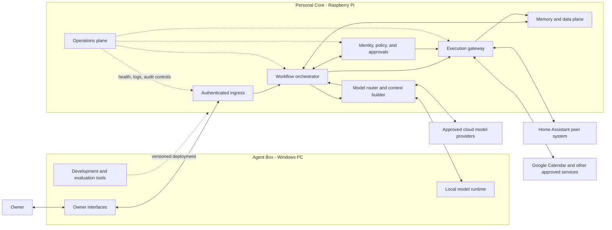
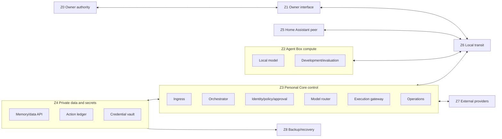

# Osun M0 System Architecture

**Tasks:** M0-02 glossary and naming; M0-20 component responsibilities; M0-21 identities, trust zones, and flows \
**State:** M0-02 and M0-20 accepted; M0-21 drafted for owner/security/privacy review \
**Accountable:** Systems architect \
**Reviewers:** Coordinator, owner, security analyst, and privacy analyst \
**Architecture phase:** Conceptual, technology-neutral, and non-production \
**Last updated:** 2026-07-26

---

## 1. Plain-language system model

The Raspberry Pi Personal Core is Osun's always-on coordinator and policy checkpoint. The Windows Agent Box provides the primary interface, development environment, and heavier local AI compute. Home Assistant remains the sole authority for physical home-device state and commands. Models may propose structured actions, but they never receive unrestricted secrets, memory, or tool access and never execute actions directly.

The design separates five questions:

1. **What did the owner ask?** Owner interface and authenticated ingress.
2. **What context is allowed?** Memory/data access and data-egress policy.
3. **What should be proposed?** Workflow logic and a replaceable model.
4. **May the proposal take effect?** Deterministic policy and approval services.
5. **Did it work?** Restricted adapters, verification, audit, and feedback.

If the owner remembers only one rule, it is this: the AI can think and suggest, but deterministic services decide what data it may see and what actions it may attempt.

---

## 2. Canonical glossary

| Term | Canonical meaning | Not used to mean |
|---|---|---|
| Owner | The human whose goals, consent, and authority govern the initial single-user system | Administrator account, model, developer, or future household member |
| Osun | The whole personal intelligence system, including interfaces, policy, workflows, data, models, tools, and operations | A single model or chatbot |
| Agent Box | The Windows PC used for primary interaction, development, and heavier local compute | Always-on authority for all workflows |
| Personal Core | The Raspberry Pi-hosted always-on coordination environment | Large-model training machine, universal database, or physical-device authority |
| Agent | A bounded software actor pursuing a workflow step under identity, policy, and tool constraints | A person, a foundation model, or unrestricted autonomous process |
| Model | A replaceable inference component that transforms approved context into a response or structured proposal | Policy engine, memory, workflow state, or action authority |
| Skill | A versioned, reusable instruction/procedure package invoked inside a workflow | A standing permission or background service |
| Workflow | A versioned state machine that turns a trigger into a bounded outcome through explicit steps and controls | An unconstrained conversation or model prompt |
| Tool | A typed capability exposed through a narrow contract | Raw shell, unrestricted account access, or arbitrary code execution |
| Event | An immutable, time-stamped statement that something was observed, requested, decided, attempted, or verified | A mutable current fact |
| Memory | A governed, attributable record used across interactions, with validity, sensitivity, and lifecycle | Entire chat history or opaque model weights |
| Artifact | A human- or machine-readable output such as a plan, document, report, or approval receipt | A hidden model state |
| Policy | A deterministic rule governing data access, egress, approval, execution, retention, or safety | Personality guidance or a model suggestion |
| Action | A typed attempt to change local or external state | A suggestion displayed without effect |
| Verification | Independent evidence that an attempted action produced the intended state | The model claiming success |
| Autonomy | Preauthorized action scope earned for one workflow and context | A global intelligence level or permission to improvise authority |
| Identity | A distinct owner, service, agent, workflow, device, or integration principal with bounded credentials | A shared all-powerful API key |
| Plane | A logical responsibility group that may move between machines without changing its contract | Necessarily a separate device or product |
| M0 | The current specification and evidence milestone; it ends with a tested paper design and M1 plan | A production release |
| M1 / Milestone 1 | The first implemented vertical slice after the M0 gate | M0 or the first planning commit |

Overloaded words should be qualified. Use "model" for inference, "agent" for a bounded actor, "workflow" for the state machine, and "Osun" for the complete system.

---

## 3. Component map



Arrows show allowed conceptual interactions, not blanket network access. M0-21 will label identities, protocols, authentication, encryption, and data sensitivity for every boundary crossing.

---

## 4. Responsibility authority map

Every capability has one authoritative component. A host may run several components, but hosting does not merge their permissions.

| Capability | Single authority | Initial host | Required boundary |
|---|---|---|---|
| Goals, consent, policy acceptance, and final override | Owner | Human-controlled interfaces | No service or model can supersede the owner |
| Capture and presentation | Owner interface | Agent Box first | Interface cannot bypass policy or execute tools directly |
| Authenticated request admission | Ingress service | Personal Core | Reject unknown identities, malformed requests, and unsupported versions |
| Workflow state, retries, and scheduling | Workflow orchestrator | Personal Core | Uses typed events; does not hold provider credentials |
| Identity and authorization decisions | Identity/policy service | Personal Core | Deterministic, deny-by-default, versioned, and independent of model text |
| Approval request and receipt | Approval service within policy plane | Personal Core | Bind approval to exact action, data, expiry, and policy version |
| Model/context selection and cloud egress | Model router | Personal Core | Redact/minimize before inference; models never choose their own permissions |
| Language reasoning and structured proposals | Selected model runtime | Agent Box locally or approved cloud | No direct secret, database, network, or tool access |
| Tool invocation, idempotency, and verification | Execution gateway | Personal Core | Execute only authorized typed actions through restricted adapters |
| Google Calendar state | Google Calendar via restricted adapter | External provider | Adapter owns protocol use; every initial write requires approval and read-back |
| Physical home-device state and commands | Home Assistant | Dedicated Home Assistant Pi | Osun requests scoped actions; Home Assistant remains device authority |
| Durable personal records and memory lifecycle | Memory/data plane | Personal Core-class storage, final medium TBD | Encrypted, backed up, attributable, correctable, exportable, deletable |
| Consequential action audit | Append-only action ledger | Personal Core-class storage | Ordinary models and adapters cannot rewrite history |
| Health, telemetry, restore, and incident controls | Operations plane | Personal Core plus backup target | Logs exclude personal content by default; pause must not require a model |
| Code, prompt, schema, and evaluation versions | Development/release process | Agent Box and Git | Production promotion is explicit, tested, and reversible |

---

## 5. Component responsibilities and non-responsibilities

### 5.1 Owner interfaces

Responsible for:

- capturing explicit requests, corrections, approvals, pause, and undo;
- displaying proposed actions, evidence, uncertainty, source freshness, and results;
- making policy state and active integrations understandable.

Must not:

- store provider secrets in ordinary UI history;
- imply success before verification;
- convert conversation into external action without the policy path.

### 5.2 Agent Box

Responsible for:

- primary desktop interaction and development;
- heavier local inference, evaluation, and optional batch processing;
- running replaceable local model runtimes when available.

Must not:

- become the only holder of durable memory or audit evidence;
- be required to remain powered on for the Personal Core to enforce policy;
- grant a local model unrestricted filesystem, secrets, or tool access.

### 5.3 Personal Core

Responsible for:

- always-on authenticated ingress, scheduling, orchestration, policy, approvals, model routing, execution, and operational control;
- maintaining workflow state across Agent Box restarts;
- failing closed when identity, policy, or approval evidence is unavailable.

Must not:

- run heavyweight model training or be assumed capable of every local model;
- expose services directly to the public internet during M0/M1;
- treat a Raspberry Pi SD card as the only durable copy of personal data.

### 5.4 Identity, policy, and approval plane

Responsible for:

- authenticating owner, service, workflow, agent, device, and integration identities;
- evaluating data access, cloud egress, action risk, and approval requirements;
- issuing short-lived capability grants and exact approval receipts;
- enforcing global pause and per-workflow disable independently of a model.

Must not:

- delegate final policy interpretation to model prose;
- use one shared credential for all services;
- allow personality, urgency, or model confidence to expand authority.

### 5.5 Workflow orchestration plane

Responsible for:

- deterministic workflow state, timers, retries, deduplication, expiration, and compensation;
- assembling steps across data, model, policy, and execution services;
- recording why a transition occurred.

Must not:

- bypass approval to satisfy a deadline;
- treat model output as a trusted event or executable command;
- hide partial failure or retry forever.

### 5.6 Model router and model runtimes

Responsible for:

- selecting an allowed local or cloud model for the request;
- constructing the minimum authorized context;
- returning structured proposals with uncertainty and grounding references.

Must not:

- retrieve arbitrary memory, read secrets, or call tools directly;
- send sensitive data to cloud providers under the initial policy;
- claim authority over goals, health decisions, or policy.

### 5.7 Execution plane

Responsible for:

- validating typed actions against capability grants;
- enforcing schema, scope, timeout, rate, idempotency, and replay protection;
- invoking one restricted adapter and independently verifying the result;
- offering undo or a compensating action when available.

Must not:

- accept free-form model text as a command;
- expose raw provider credentials to workflows or models;
- report success solely because an API call returned without error.

### 5.8 Memory and data plane

Responsible for:

- immutable source events, versioned facts, confirmed preferences, workflow state, artifacts, and evaluation records;
- provenance, sensitivity, retention, correction, supersession, export, and deletion;
- policy-filtered retrieval through one governed memory API.

Must not:

- use a vector index as the source of truth;
- silently promote inference into durable fact;
- put live sensitive databases, secrets, or model data in the current OneDrive repository.

### 5.9 Operations plane

Responsible for:

- service health, structured telemetry, audit protection, backups, restore checks, upgrades, and incident controls;
- visible degraded/offline state and freshness;
- a pause path that works without model inference.

Must not:

- log personal content by default;
- auto-update critical components without rollback evidence;
- mark backups healthy without a restore test.

### 5.10 Home Assistant

Responsible for:

- physical device registry, state, automations, safety interlocks, and supported device commands;
- authenticating narrowly scoped requests from Osun when that integration is later approved.

Must not:

- become Osun's general memory or model host merely because it is always on;
- expose unrestricted administration to Osun;
- surrender device authority to generated model text.

### 5.11 External services

Responsible for their own authoritative external state and documented protocols. Osun adapters translate narrow typed contracts, expose freshness, and tolerate unavailability.

External services must not become implicit sources of truth for owner goals or Osun policy. Connecting one service does not authorize other services or additional fields.

---

## 6. Offline and degraded operation

| Function | Agent Box offline | Internet offline | Personal Core offline |
|---|---|---|---|
| View/edit owner-controlled policy | Available through Personal Core interface | Available locally | Emergency pause remains available; normal edits wait for recovery |
| Manual daily plan using local model | Unavailable if Agent Box supplies the model; deterministic fallback may remain | Available when Agent Box and Core are local | Unavailable except local draft UI; no actions |
| Manual calorie capture | Queue locally only if approved local data store is healthy | Available locally | Must fail safely or queue with explicit uncommitted state |
| Read fresh Google Calendar | Available if Core and internet are healthy | Unavailable; show last cache and freshness | Unavailable |
| Write Google Calendar | Available only through approval/execution path | Unavailable; proposal may queue but approval expires | Prohibited |
| Home Assistant device control | Direct Home Assistant UI remains independent | Local HA operation may remain | Direct Home Assistant UI remains independent; Osun control unavailable |
| Policy enforcement for Osun actions | Available | Available | Osun actions fail closed |
| Audit and workflow recovery | Available | Available | Resume from durable state after Core recovery |

Offline mode never pretends cached external data is current. Queued consequential actions must be revalidated against policy, expiry, and current state before execution.

---

## 7. Replaceability boundaries

| Replaceable concern | Stable boundary | Reason |
|---|---|---|
| Local or cloud model | Model request/response schema plus capability declaration | Personal learning and workflows survive model changes |
| Memory/storage engine | Governed memory API and export format | Avoid lock-in and permit migration without rewriting workflows |
| Message transport | Versioned event envelope | Components can move between processes or machines |
| Windows/Pi hardware | Service identity and deployment manifest | A future server can replace a Pi without becoming a new authority |
| Owner interface | Authenticated request, approval, and presentation contracts | Desktop, mobile, voice, or web interfaces can coexist later |
| External provider | Typed tool contract and restricted adapter | Calendar or model providers can change without changing policy semantics |
| Workflow implementation | Versioned state-machine contract | Procedures evolve without granting new permissions |

Hardware is deployment, not identity. Moving the policy service from one approved machine to another must preserve its service identity, keys, version, state, and audit chain through a controlled migration.

---

## 8. Initial physical deployment intent

| Physical system | M0/M1 intent | Explicit exclusion |
|---|---|---|
| Windows 11 Agent Box | Development, owner interface, local model experiments, evaluation | No always-on dependency; no unrestricted model access |
| Pi OS Raspberry Pi 4 | Candidate Personal Core for light always-on services after backup/storage design | No heavy model training; no sole sensitive store on SD card |
| Home Assistant OS Raspberry Pi 4 | Preserve as peer physical-device authority | Do not reimage or merge with the Personal Core |
| Third Raspberry Pi 4 | Keep unconfigured; possible staging, recovery, or monitoring role after architecture decisions | No assignment merely because hardware is available |
| OneDrive Git workspace | Versioned specifications and non-sensitive code | No secrets, credentials, raw health/calorie data, or live personal databases |

No installation, reconfiguration, credential grant, network exposure, or data migration is authorized by this M0 diagram.

---

## 9. M0-20 acceptance check

- [x] Owner interfaces, Agent Box, Personal Core, identity/policy, execution, memory/data, and operations planes are defined.
- [x] Home Assistant and external services are peer systems.
- [x] Every named capability has a single authority.
- [x] Each component has explicit non-responsibilities.
- [x] Model, store, transport, interface, adapter, workflow, and hardware boundaries are replaceable.
- [x] Required offline and fail-closed behavior is stated.
- [x] No model has unrestricted access to secrets, tools, or all memory.
- [x] Owner confirms the plain-language component map matches their intent.
- [x] Owner can identify which component coordinates, computes, controls physical devices, and authorizes actions.

**Owner decision:** M0-20 component responsibilities accepted as written on 2026-07-26.

---

## 10. Identity model

Every actor uses a distinct identity. An identity says who or what is acting; a capability says what that identity may do for a specific purpose and time. Neither a network location nor possession of a shared API key is sufficient authority.

| Identity type | Canonical form | Initial examples | Authentication expectation | Authority ceiling |
|---|---|---|---|---|
| Owner | `owner:primary` | The initial human owner | Phishing-resistant owner authentication for policy and consequential approval; method selected later | Final authority within accepted safety/legal constraints |
| Owner session | `session:<random-id>` | Desktop or future mobile session | Short-lived session bound to owner and interface/device context | Only the scopes and expiry granted to that session |
| Device | `device:<name>` | `agent-box`, `personal-core`, `home-assistant` | Unique device key; mutually authenticated channel where supported | Connect only to named services; no inherited owner authority |
| Service | `service:<name>` | `ingress`, `orchestrator`, `policy`, `router`, `executor`, `memory`, `operations` | Unique service identity and least-privilege credential | Only its responsibility in Section 4 |
| Workflow definition | `workflow:<id>@<version>` | `wf-01@0`, `wf-02@0`, `wf-03@0` | Signed/versioned deployment record | Only declared data, model, tool, and action contracts |
| Workflow run | `run:<uuid>` | One daily plan or calorie-capture run | Created by orchestrator; bound to workflow version, owner, and correlation ID | Expires with run; cannot mint broader authority |
| Agent instance | `agent:<role>:<run-id>` | Planner or estimator used inside one run | Ephemeral capability from orchestrator/policy plane | Proposals only unless a typed step has a separate execution grant |
| Model runtime | `model:<provider>:<model-version>` | Local model on Agent Box or approved cloud model | Local service identity or provider credential held by router | Inference over provided context only; no direct tools or memory |
| Integration | `integration:<provider>:<alias>` | Google Calendar or Home Assistant adapter | Provider-specific credential held in vault and used only by adapter | Narrow provider scopes and owner-approved resources |
| Data subject | `subject:<id>` | `subject:owner` | Not an actor; attached to records | Enables purpose, consent, access, and deletion rules |
| Recovery operator | `recovery:owner` | Owner using offline recovery material | Strong separate recovery procedure | Restore, revoke, rotate, and pause; no ordinary workflow use |

Identity rules:

1. No credential is shared by the model, workflow, policy service, and adapter.
2. Long-lived secrets remain in a dedicated vault; workflows receive short-lived capabilities or indirect adapter access.
3. Capabilities bind actor, workflow, action, resource, purpose, sensitivity, expiry, and policy version.
4. Approval binds to the exact normalized action and cannot be replayed for a changed payload.
5. Service and device identities are revocable independently.
6. Human-readable names are aliases; stable opaque IDs are used in contracts and audit.
7. A model name or personality is never an authenticated actor.

---

## 11. Trust zones

Trust is not inferred from being inside the house. Local-network traffic is treated as crossing a boundary and receives authentication, encryption where supported, validation, and audit appropriate to its consequence.

| Zone | Contents | Trusted for | Not trusted for |
|---|---|---|---|
| Z0 Owner authority | Human decision, explicit approval, recovery material kept separately | Goal/policy decisions, consent, pause, final override | Perfect attention, infallible approval, or continuous availability |
| Z1 Owner interface | Desktop UI and future authenticated mobile/web surfaces | Capturing/displaying bounded requests and approvals | Direct tool execution, secret storage in history, or policy bypass |
| Z2 Agent Box compute | Windows PC, local models, development/evaluation tools | Heavy local inference and owner-present development | Always-on coordination or unrestricted access to data/tools |
| Z3 Personal Core control | Ingress, orchestrator, identity/policy, router, executor, operations | Workflow state and deterministic authority enforcement | Heavy training or sole durable storage on SD card |
| Z4 Private data and secret boundary | Memory API, databases, object store, action ledger, credential vault | Approved durable records and exact adapter credentials | General browsing by models, workflows, or administrators without purpose |
| Z5 Home Assistant peer | Existing Home Assistant OS instance and device integrations | Physical-device source of truth and safety controls | General Osun authority or unrestricted administration by Osun |
| Z6 Local transit | Wi-Fi, Ethernet, router/switch, local name resolution | Packet transport only | Identity, confidentiality by location alone, or message correctness |
| Z7 External providers | Google Calendar, approved cloud models, future external APIs | Their documented service and authoritative external state | Osun policy, owner goals, safe instructions, or unnecessary data retention |
| Z8 Backup/recovery | Encrypted backup target and offline recovery material, technology TBD | Recovery of approved records and configuration | Live execution or ordinary model access |



Physical co-location does not erase a logical boundary. Z3 and Z4 may initially share a host, but operating-system accounts, service identities, access controls, APIs, encryption keys, and audit must preserve their separation.

---

## 12. Boundary-crossing control matrix

The table states M0 requirements, not final product choices. Specific protocols and products remain for M0-24 and M0-40.

| Crossing | Data/action | Authentication | Authorization | Encryption | Validation and freshness | Audit/failure behavior |
|---|---|---|---|---|---|---|
| Z0 owner -> Z1 interface | Request, correction, approval, pause | Owner session; stronger reauthentication for policy/recovery | Session scopes; exact approval receipt for R3 | Platform/session protection | Typed UI, explicit consequence, expiry, payload hash | Record decision metadata; cancel safely if session expires |
| Z1 interface -> Z3 ingress over Z6 | Personal request or command | Mutually authenticated device/service channel plus owner session | Ingress verifies session, workflow, schema, rate, and replay state | Encrypted authenticated transport | Schema/version, size, timestamp, nonce, correlation ID | Reject invalid/replayed requests; content-minimized trace |
| Z3 orchestrator -> Z4 memory API | Context query or governed write | Unique orchestrator identity | Purpose- and workflow-bound capability; field/sensitivity filters | Authenticated local channel; encryption at rest | Record schema, provenance, validity time, retention | Log access decision and record IDs, not unnecessary content |
| Z3 orchestrator -> Z3 policy | Data/action decision request | Unique service identities | Policy version and requested capability; deny by default | Authenticated local channel | Normalize action before evaluation; reject ambiguous fields | Append decision, reason code, policy version, expiry |
| Z3 router -> Z2 local model over Z6 | Minimized model context | Device and model-runtime identities | Router-issued single-request scope | Encrypted authenticated transport | Prompt envelope, schema, sensitivity labels, output limits | Treat output as untrusted; timeout or malformed output returns no action |
| Z3 router -> Z7 cloud model | Approved minimal context | Provider credential held only by router/vault path | Egress policy by data type, workflow, and provider | Provider TLS with certificate validation | Redaction, allowlisted fields, provider/model version, response schema | Record categories and purpose; sensitive health/calorie context blocked |
| Z3 policy -> Z3 executor | Exact action capability | Policy and executor service identities | Signed/opaque grant bound to payload hash, tool, expiry, run | Authenticated local channel | Recompute normalized hash; reject replay/expired grant | Record authorization and denial; no fallback bypass |
| Z3 executor -> Z7 Google Calendar | Read or approved write | Calendar adapter uses scoped OAuth token from vault | Approved calendars/fields; every initial write has exact R3 approval | Provider TLS | Schema, ETag/version where available, idempotency key, read-back | Record provider IDs and verification; failure remains visible and retry-bounded |
| Z3 executor -> Z5 Home Assistant over Z6 | Future typed device request | Dedicated Osun service identity in Home Assistant | Entity/service allowlist and HA-side controls | Authenticated encrypted local transport where supported | Typed values, current state, safety constraints, idempotency | HA remains authoritative; verify state; fail closed if uncertain |
| Z3 services -> Z3 operations/Z4 ledger | Metrics, security event, action evidence | Per-service identity | Append-only or narrowly scoped telemetry write | Authenticated local channel; protected at rest | Structured schema, correlation, redaction | Reject personal content by default; alert on gaps/tampering |
| Z4 data -> Z8 backup | Encrypted records and configuration | Backup service identity plus recovery-controlled key | Dataset allowlist and retention policy | Encrypt before leaving source; authenticated destination | Manifest, checksum, version, restore compatibility | Record backup and test restore; a copy alone is not a verified backup |

Unresolved controls are explicit risks, not silent assumptions:

- exact device/service authentication technology;
- vault implementation and recovery-key custody;
- durable storage and encrypted backup target;
- Home Assistant's supported transport/authentication for the later Osun integration;
- safe remote owner access, which remains prohibited until separately designed;
- clock synchronization and behavior during large clock drift.

---

## 13. Common event and flow rules

Every workflow run carries:

- immutable run, correlation, and causation IDs;
- owner, workflow definition/version, and initiating identity;
- occurred-at and received-at timestamps plus source freshness;
- data sensitivity, purpose, retention, and provenance references;
- policy, model, prompt, adapter, and schema versions used;
- explicit state transitions and terminal outcome.

Common processing sequence:

```text
authenticate trigger
-> validate and deduplicate
-> load only purpose-authorized context
-> create proposal with a replaceable model or deterministic fallback
-> treat proposal as untrusted data
-> evaluate policy and obtain approval if required
-> execute through one restricted adapter when authorized
-> independently verify
-> write audit evidence
-> request feedback
-> create candidate memory only under memory policy
```

No failure after proposal generation may be rewritten as success. No retry may broaden scopes, change the action payload, or reuse an expired approval.

---

## 14. WF-01 end-to-end flow: Daily Consistency Plan

**Maximum sensitivity:** Personal initially; Sensitive if event titles or health context are later enabled. \
**Cloud rule:** Minimal owner-approved goal/task text only; calendar titles and health data denied by default. \
**Action ceiling:** Suggestions and local saves; every Google Calendar write requires preview and explicit approval.

| Step | Authority/component | Input and control | Output/evidence |
|---|---|---|---|
| 1. Trigger | Owner interface or scheduler | Authenticated owner request or one allowed daily prompt; quiet hours and workflow-disable checked | New `wf-01` run or a recorded suppressed trigger |
| 2. Intent capture | Interface -> ingress | Owner text is size/schema validated; external pasted content remains untrusted | Normalized request with provenance |
| 3. Context retrieval | Orchestrator -> memory | Read confirmed goals/preferences and recent plan outcomes under WF-01 purpose | Attributed context bundle; missing means unknown |
| 4. Calendar availability | Executor -> Google Calendar | Read-only Stage A fields; freshness and selected calendar aliases enforced | Busy/free blocks or explicit unavailable/stale state |
| 5. Context routing | Router/policy | Remove unnecessary content; cloud route allowed only for approved minimal fields | Model request envelope with sensitivity and provider decision |
| 6. Plan proposal | Model runtime | Model sees only supplied context and emits a schema-bound proposal | Untrusted proposed actions, timing, uncertainty, and sources |
| 7. Policy/evaluation | Orchestrator + policy | Validate feasibility, non-scope, action risks, notification budget, and current policy | Allowed suggestion, denied proposal, or correction request |
| 8. Owner presentation | Interface | Show editable plan, source freshness, uncertainty, and any proposed effects | Owner edit, dismiss, snooze, or Submit/Save |
| 9. Local save | Memory/data plane | Submit/Save authorizes the exact local plan; no external effect | Versioned plan artifact and audit event |
| 10. Optional calendar write | Policy -> executor -> Google | Separate preview and R3 approval bound to exact event; scoped adapter writes and reads back | Verified external event plus undo option, or visible failure |
| 11. Outcome feedback | Interface -> memory | Owner may record result/usefulness; absence is unknown, not failure | Raw outcome observation with RET-2 policy |
| 12. Learning | Memory service | Preference inference remains candidate until confirmed; preserve source links | Candidate/confirmed memory, correction, or no promotion |

Failure behavior:

- stale calendar: show freshness and propose an unscheduled plan or ask the owner;
- unavailable model: use a deterministic owner-editable template or stop before claiming a personalized plan;
- duplicate trigger: reuse/open the existing run rather than create competing daily plans;
- malicious calendar title when Stage B is later enabled: treat as data, never as an instruction;
- expired approval: show the proposal again and require a fresh approval before writing.

---

## 15. WF-02 end-to-end flow: Weekly Health Plan

**Maximum sensitivity:** Sensitive. \
**Cloud rule:** Meal, workout, energy, sleep, calorie, and Apple Health information remains local-only. \
**Action ceiling:** Local proposals/saves; calendar writes only through separate preview and approval; no purchases, diagnosis, treatment, or health-record writes.

| Step | Authority/component | Input and control | Output/evidence |
|---|---|---|---|
| 1. Trigger | Owner interface or scheduler | Authenticated request or one allowed weekly prompt; dismissal lowers future frequency | New `wf-02` run or suppressed trigger |
| 2. Constraint capture | Interface/ingress | Explicit schedule, food, equipment, time, budget band, and owner-stated limitations; no clinical inference | Normalized owner constraints with sensitivity labels |
| 3. Local context | Orchestrator -> memory | Retrieve only current confirmed preferences, recent plan corrections, and approved wellness summaries | Attributed local context; missing data remains unknown |
| 4. Calendar availability | Restricted adapter | Stage A busy/free fields and freshness; no titles by default | Feasible time windows or unavailable state |
| 5. Health data check | Policy + memory | Only individually enabled aggregate types; absence never interpreted as zero or noncompliance | Optional local wellness summary with authorization provenance |
| 6. Local proposal | Router -> local model | Sensitive context forces local route; schema restricts meals/workouts and requires uncertainty | Draft weekly plan and explicit assumptions |
| 7. Safety/policy check | Policy/orchestrator | Reject diagnosis, treatment, restrictive automatic goals, conflict with stated pain/fatigue, purchase, or external communication | Allowed editable proposal, narrowed request, or refusal |
| 8. Owner review | Interface | Show assumptions, conflicts, source freshness, and bounded edits | Accept, edit, regenerate, dismiss, or save |
| 9. Local save | Memory/data plane | Submit/Save applies to the exact reviewed plan | Versioned sensitive plan; local-only audit |
| 10. Optional calendar actions | Policy/executor | Each event receives separate exact preview/approval and read-back verification | Verified calendar items and undo, or no effect |
| 11. Outcome and learning | Interface/memory | Owner corrections and usefulness may become candidates; plan adherence is not moralized | Raw feedback plus confirmed/candidate preference updates |

Failure behavior:

- unavailable local model: offer a blank structured planner, never route sensitive context to cloud as a fallback;
- missing or denied HealthKit data: continue without it and state that it was unavailable;
- conflicting constraint: ask the owner or omit the affected item rather than override pain, fatigue, schedule, or preference;
- out-of-order correction: attach it to the referenced plan version; never overwrite a newer plan silently;
- duplicate scheduled prompt: suppress using workflow/week idempotency key.

---

## 16. WF-03 end-to-end flow: Low-Friction Calorie Capture

**Maximum sensitivity:** Sensitive. \
**Cloud rule:** Food text, calorie/nutrition estimates, corrections, and summaries remain local-only. \
**Action ceiling:** Local calculation, estimate, display, correction, and intentional save; no external sharing or health-record write.

| Step | Authority/component | Input and control | Output/evidence |
|---|---|---|---|
| 1. Trigger | Owner interface | Manual owner entry only in the initial workflow; no unsolicited calorie reminder | New `wf-03` run tied to one meal/capture intent |
| 2. Input capture | Interface/ingress | Validate owner text, time, and meal grouping; no photo initially; pasted content is untrusted | Normalized local food-entry observation |
| 3. Reference retrieval | Memory/local reference adapter | Search approved local food/nutrition references; keep provenance and units | Candidate matches or explicit insufficient evidence |
| 4. Local estimation | Deterministic calculator/local model | No cloud route; structured output requires units, range/confidence, and source | Untrusted estimate or abstention |
| 5. Validation | Orchestrator/policy | Reject impossible units, fabricated precision, hidden restrictive targets, or cross-purpose use | Displayable estimate, clarification request, or refusal to guess |
| 6. Owner correction | Interface | Show source, uncertainty, alternatives, and easy edit | Confirmed amount/match or intentionally unresolved entry |
| 7. Local save | Memory/data plane | Submit/Save authorizes only the exact entry and estimate | Versioned record with derivation and RET-2 policy |
| 8. Local review | Local computation | Aggregate only saved records; missing entries remain missing | Local summary labeled incomplete when appropriate |
| 9. Learning | Memory service | Corrections may create candidate food mappings; confirmation required before durable preference/procedure | Candidate mapping, confirmed mapping, or no promotion |

Failure behavior:

- no reliable match: display alternatives/range or abstain; never invent precision;
- duplicate submit: idempotency key returns the existing record rather than double-counting;
- late correction: supersede the earlier version while retaining provenance;
- malicious reference text: parse as reference data only and reject embedded instructions;
- storage unavailable: keep an explicitly unsaved local draft only while the interface is open or ask the owner to retry.

---

## 17. Anomalous-input and ordering rules

| Condition | Detection | Required response | Prohibited response |
|---|---|---|---|
| Missing | Required field absent or permission/source unavailable | Mark unknown, omit dependency, ask narrowly, or stop | Treat as zero, false, failure, or inferred consent |
| Stale | Source freshness exceeds workflow policy | Show age, use only if allowed, refresh, or degrade | Claim current knowledge |
| Duplicate | Same idempotency key, source ID/version, or semantic action identity | Return prior result or merge under explicit rule | Repeat an external effect or double-count a record |
| Out of order | Occurred-at/version precedes current accepted state | Preserve event, attach to correct version, recompute only under policy | Silently overwrite newer state |
| Conflicting | Two claims disagree for overlapping validity | Keep both with provenance; ask owner or choose only under explicit source precedence | Hide conflict or convert an inference into fact |
| Malicious/injected | Untrusted content contains instruction-like text, links, or tool requests | Keep as quoted data, strip active markup, constrain parser, alert/deny if needed | Follow it as system/workflow instruction |
| Malformed | Schema, type, bounds, unit, encoding, or signature invalid | Reject and record reason without unsafe echo | Coerce into an action silently |
| Replay | Nonce, approval, event, or capability already used or expired | Deny; surface safe status; investigate repeated attempts | Re-execute because the payload looks familiar |
| Partial external success | Provider call ambiguous, timed out, or verification disagrees | Read authoritative state before retry; show uncertainty | Blind retry or declare failure/success without verification |
| Clock drift | Timestamps differ beyond accepted tolerance | Quarantine time-sensitive action, resynchronize, require fresh approval | Extend approvals or reorder silently |

---

## 18. M0-21 acceptance check

- [x] Owner, session, device, service, workflow, run, agent, model, integration, subject, and recovery identities are defined.
- [x] Trust zones cover owner surfaces, Agent Box, Personal Core, private data/secrets, Home Assistant, local transit, external providers, and recovery.
- [x] Authentication, authorization, encryption, validation, freshness, audit, and failure expectations label each boundary crossing.
- [x] WF-01, WF-02, and WF-03 trace from trigger through possible memory update.
- [x] Sensitivity and cloud-egress rules are explicit for every selected workflow.
- [x] Stale, missing, duplicated, conflicting, malicious, malformed, replayed, partial, and out-of-order input behavior is defined.
- [x] Every boundary has a named conceptual control or explicit unresolved implementation risk.
- [ ] Owner approves the identity/trust/flow model.
- [ ] M0-22 and M0-23 challenge these assumptions through threat and privacy reviews.

---

## 19. Deferred to M0-22 and later

M0-22 through M0-24 will challenge the map through threat modeling, privacy analysis, and version-zero contracts. They will determine whether the conceptual controls are sufficient, identify high/critical failure paths, and turn the boundaries into testable schemas.

Technology selection, protocol selection, credential creation, installation, and network changes remain deferred to M0-40/M0-41. Safe remote owner access remains out of scope until a separately reviewed design exists.

---

## Artifact status

- Author/agent: Primary AI coordinator acting as systems architect
- Reviewer: Coordinator and owner
- Status: M0-02 and M0-20 accepted; M0-21 owner/security/privacy review
- Inputs used: Accepted charter, workflow catalog, data/autonomy boundaries, current-system inventory, living master plan
- Assumptions: Pi OS unit is the Personal Core candidate; Home Assistant installation is preserved; durable storage and backup technology remain undecided
- Open questions: Owner approval of Sections 10-18; implementation choices and risks deferred to M0-22 through M0-24 and M0-40
- Acceptance evidence: Canonical glossary, accepted component map, identity model, trust zones, boundary control matrix, three request-to-memory traces, anomaly rules, offline behavior, replaceability boundaries, and deployment intent
- Last updated: 2026-07-26
