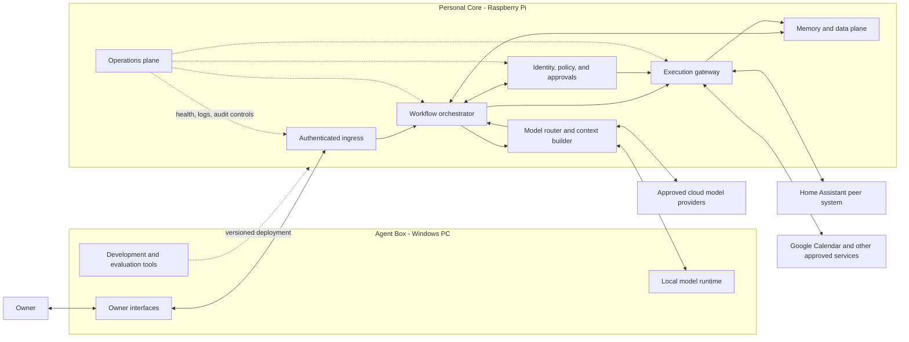

# Osun M0 System Architecture

**Tasks:** M0-02 glossary and naming; M0-20 component responsibilities \
**State:** Component map drafted for owner review; M0-21 trust/data-flow work not started \
**Accountable:** Systems architect \
**Reviewer:** Coordinator and owner comprehension check \
**Architecture phase:** Conceptual, technology-neutral, and non-production \
**Last updated:** 2026-07-26

---

## 1. Plain-language system model

The Raspberry Pi Personal Core is Osun's always-on coordinator and policy checkpoint. The Windows Agent Box provides the primary interface, development environment, and heavier local AI compute. Home Assistant remains the sole authority for physical home-device state and commands. Models may propose structured actions, but they never receive unrestricted secrets, memory, or tool access and never execute actions directly.

The design separates five questions:

1. **What did the owner ask?** Owner interface and authenticated ingress.
2. **What context is allowed?** Memory/data access and data-egress policy.
3. **What should be proposed?** Workflow logic and a replaceable model.
4. **May the proposal take effect?** Deterministic policy and approval services.
5. **Did it work?** Restricted adapters, verification, audit, and feedback.

If the owner remembers only one rule, it is this: the AI can think and suggest, but deterministic services decide what data it may see and what actions it may attempt.

---

## 2. Canonical glossary

| Term | Canonical meaning | Not used to mean |
|---|---|---|
| Owner | The human whose goals, consent, and authority govern the initial single-user system | Administrator account, model, developer, or future household member |
| Osun | The whole personal intelligence system, including interfaces, policy, workflows, data, models, tools, and operations | A single model or chatbot |
| Agent Box | The Windows PC used for primary interaction, development, and heavier local compute | Always-on authority for all workflows |
| Personal Core | The Raspberry Pi-hosted always-on coordination environment | Large-model training machine, universal database, or physical-device authority |
| Agent | A bounded software actor pursuing a workflow step under identity, policy, and tool constraints | A person, a foundation model, or unrestricted autonomous process |
| Model | A replaceable inference component that transforms approved context into a response or structured proposal | Policy engine, memory, workflow state, or action authority |
| Skill | A versioned, reusable instruction/procedure package invoked inside a workflow | A standing permission or background service |
| Workflow | A versioned state machine that turns a trigger into a bounded outcome through explicit steps and controls | An unconstrained conversation or model prompt |
| Tool | A typed capability exposed through a narrow contract | Raw shell, unrestricted account access, or arbitrary code execution |
| Event | An immutable, time-stamped statement that something was observed, requested, decided, attempted, or verified | A mutable current fact |
| Memory | A governed, attributable record used across interactions, with validity, sensitivity, and lifecycle | Entire chat history or opaque model weights |
| Artifact | A human- or machine-readable output such as a plan, document, report, or approval receipt | A hidden model state |
| Policy | A deterministic rule governing data access, egress, approval, execution, retention, or safety | Personality guidance or a model suggestion |
| Action | A typed attempt to change local or external state | A suggestion displayed without effect |
| Verification | Independent evidence that an attempted action produced the intended state | The model claiming success |
| Autonomy | Preauthorized action scope earned for one workflow and context | A global intelligence level or permission to improvise authority |
| Identity | A distinct owner, service, agent, workflow, device, or integration principal with bounded credentials | A shared all-powerful API key |
| Plane | A logical responsibility group that may move between machines without changing its contract | Necessarily a separate device or product |
| M0 | The current specification and evidence milestone; it ends with a tested paper design and M1 plan | A production release |
| M1 / Milestone 1 | The first implemented vertical slice after the M0 gate | M0 or the first planning commit |

Overloaded words should be qualified. Use "model" for inference, "agent" for a bounded actor, "workflow" for the state machine, and "Osun" for the complete system.

---

## 3. Component map

Arrows show allowed conceptual interactions, not blanket network access. M0-21 will label identities, protocols, authentication, encryption, and data sensitivity for every boundary crossing.

---

## 4. Responsibility authority map

Every capability has one authoritative component. A host may run several components, but hosting does not merge their permissions.

| Capability | Single authority | Initial host | Required boundary |
|---|---|---|---|
| Goals, consent, policy acceptance, and final override | Owner | Human-controlled interfaces | No service or model can supersede the owner |
| Capture and presentation | Owner interface | Agent Box first | Interface cannot bypass policy or execute tools directly |
| Authenticated request admission | Ingress service | Personal Core | Reject unknown identities, malformed requests, and unsupported versions |
| Workflow state, retries, and scheduling | Workflow orchestrator | Personal Core | Uses typed events; does not hold provider credentials |
| Identity and authorization decisions | Identity/policy service | Personal Core | Deterministic, deny-by-default, versioned, and independent of model text |
| Approval request and receipt | Approval service within policy plane | Personal Core | Bind approval to exact action, data, expiry, and policy version |
| Model/context selection and cloud egress | Model router | Personal Core | Redact/minimize before inference; models never choose their own permissions |
| Language reasoning and structured proposals | Selected model runtime | Agent Box locally or approved cloud | No direct secret, database, network, or tool access |
| Tool invocation, idempotency, and verification | Execution gateway | Personal Core | Execute only authorized typed actions through restricted adapters |
| Google Calendar state | Google Calendar via restricted adapter | External provider | Adapter owns protocol use; every initial write requires approval and read-back |
| Physical home-device state and commands | Home Assistant | Dedicated Home Assistant Pi | Osun requests scoped actions; Home Assistant remains device authority |
| Durable personal records and memory lifecycle | Memory/data plane | Personal Core-class storage, final medium TBD | Encrypted, backed up, attributable, correctable, exportable, deletable |
| Consequential action audit | Append-only action ledger | Personal Core-class storage | Ordinary models and adapters cannot rewrite history |
| Health, telemetry, restore, and incident controls | Operations plane | Personal Core plus backup target | Logs exclude personal content by default; pause must not require a model |
| Code, prompt, schema, and evaluation versions | Development/release process | Agent Box and Git | Production promotion is explicit, tested, and reversible |

---

## 5. Component responsibilities and non-responsibilities

### 5.1 Owner interfaces

Responsible for:

- capturing explicit requests, corrections, approvals, pause, and undo;
- displaying proposed actions, evidence, uncertainty, source freshness, and results;
- making policy state and active integrations understandable.

Must not:

- store provider secrets in ordinary UI history;
- imply success before verification;
- convert conversation into external action without the policy path.

### 5.2 Agent Box

Responsible for:

- primary desktop interaction and development;
- heavier local inference, evaluation, and optional batch processing;
- running replaceable local model runtimes when available.

Must not:

- become the only holder of durable memory or audit evidence;
- be required to remain powered on for the Personal Core to enforce policy;
- grant a local model unrestricted filesystem, secrets, or tool access.

### 5.3 Personal Core

Responsible for:

- always-on authenticated ingress, scheduling, orchestration, policy, approvals, model routing, execution, and operational control;
- maintaining workflow state across Agent Box restarts;
- failing closed when identity, policy, or approval evidence is unavailable.

Must not:

- run heavyweight model training or be assumed capable of every local model;
- expose services directly to the public internet during M0/M1;
- treat a Raspberry Pi SD card as the only durable copy of personal data.

### 5.4 Identity, policy, and approval plane

Responsible for:

- authenticating owner, service, workflow, agent, device, and integration identities;
- evaluating data access, cloud egress, action risk, and approval requirements;
- issuing short-lived capability grants and exact approval receipts;
- enforcing global pause and per-workflow disable independently of a model.

Must not:

- delegate final policy interpretation to model prose;
- use one shared credential for all services;
- allow personality, urgency, or model confidence to expand authority.

### 5.5 Workflow orchestration plane

Responsible for:

- deterministic workflow state, timers, retries, deduplication, expiration, and compensation;
- assembling steps across data, model, policy, and execution services;
- recording why a transition occurred.

Must not:

- bypass approval to satisfy a deadline;
- treat model output as a trusted event or executable command;
- hide partial failure or retry forever.

### 5.6 Model router and model runtimes

Responsible for:

- selecting an allowed local or cloud model for the request;
- constructing the minimum authorized context;
- returning structured proposals with uncertainty and grounding references.

Must not:

- retrieve arbitrary memory, read secrets, or call tools directly;
- send sensitive data to cloud providers under the initial policy;
- claim authority over goals, health decisions, or policy.

### 5.7 Execution plane

Responsible for:

- validating typed actions against capability grants;
- enforcing schema, scope, timeout, rate, idempotency, and replay protection;
- invoking one restricted adapter and independently verifying the result;
- offering undo or a compensating action when available.

Must not:

- accept free-form model text as a command;
- expose raw provider credentials to workflows or models;
- report success solely because an API call returned without error.

### 5.8 Memory and data plane

Responsible for:

- immutable source events, versioned facts, confirmed preferences, workflow state, artifacts, and evaluation records;
- provenance, sensitivity, retention, correction, supersession, export, and deletion;
- policy-filtered retrieval through one governed memory API.

Must not:

- use a vector index as the source of truth;
- silently promote inference into durable fact;
- put live sensitive databases, secrets, or model data in the current OneDrive repository.

### 5.9 Operations plane

Responsible for:

- service health, structured telemetry, audit protection, backups, restore checks, upgrades, and incident controls;
- visible degraded/offline state and freshness;
- a pause path that works without model inference.

Must not:

- log personal content by default;
- auto-update critical components without rollback evidence;
- mark backups healthy without a restore test.

### 5.10 Home Assistant

Responsible for:

- physical device registry, state, automations, safety interlocks, and supported device commands;
- authenticating narrowly scoped requests from Osun when that integration is later approved.

Must not:

- become Osun's general memory or model host merely because it is always on;
- expose unrestricted administration to Osun;
- surrender device authority to generated model text.

### 5.11 External services

Responsible for their own authoritative external state and documented protocols. Osun adapters translate narrow typed contracts, expose freshness, and tolerate unavailability.

External services must not become implicit sources of truth for owner goals or Osun policy. Connecting one service does not authorize other services or additional fields.

---

## 6. Offline and degraded operation

| Function | Agent Box offline | Internet offline | Personal Core offline |
|---|---|---|---|
| View/edit owner-controlled policy | Available through Personal Core interface | Available locally | Emergency pause remains available; normal edits wait for recovery |
| Manual daily plan using local model | Unavailable if Agent Box supplies the model; deterministic fallback may remain | Available when Agent Box and Core are local | Unavailable except local draft UI; no actions |
| Manual calorie capture | Queue locally only if approved local data store is healthy | Available locally | Must fail safely or queue with explicit uncommitted state |
| Read fresh Google Calendar | Available if Core and internet are healthy | Unavailable; show last cache and freshness | Unavailable |
| Write Google Calendar | Available only through approval/execution path | Unavailable; proposal may queue but approval expires | Prohibited |
| Home Assistant device control | Direct Home Assistant UI remains independent | Local HA operation may remain | Direct Home Assistant UI remains independent; Osun control unavailable |
| Policy enforcement for Osun actions | Available | Available | Osun actions fail closed |
| Audit and workflow recovery | Available | Available | Resume from durable state after Core recovery |

Offline mode never pretends cached external data is current. Queued consequential actions must be revalidated against policy, expiry, and current state before execution.

---

## 7. Replaceability boundaries

| Replaceable concern | Stable boundary | Reason |
|---|---|---|
| Local or cloud model | Model request/response schema plus capability declaration | Personal learning and workflows survive model changes |
| Memory/storage engine | Governed memory API and export format | Avoid lock-in and permit migration without rewriting workflows |
| Message transport | Versioned event envelope | Components can move between processes or machines |
| Windows/Pi hardware | Service identity and deployment manifest | A future server can replace a Pi without becoming a new authority |
| Owner interface | Authenticated request, approval, and presentation contracts | Desktop, mobile, voice, or web interfaces can coexist later |
| External provider | Typed tool contract and restricted adapter | Calendar or model providers can change without changing policy semantics |
| Workflow implementation | Versioned state-machine contract | Procedures evolve without granting new permissions |

Hardware is deployment, not identity. Moving the policy service from one approved machine to another must preserve its service identity, keys, version, state, and audit chain through a controlled migration.

---

## 8. Initial physical deployment intent

| Physical system | M0/M1 intent | Explicit exclusion |
|---|---|---|
| Windows 11 Agent Box | Development, owner interface, local model experiments, evaluation | No always-on dependency; no unrestricted model access |
| Pi OS Raspberry Pi 4 | Candidate Personal Core for light always-on services after backup/storage design | No heavy model training; no sole sensitive store on SD card |
| Home Assistant OS Raspberry Pi 4 | Preserve as peer physical-device authority | Do not reimage or merge with the Personal Core |
| Third Raspberry Pi 4 | Keep unconfigured; possible staging, recovery, or monitoring role after architecture decisions | No assignment merely because hardware is available |
| OneDrive Git workspace | Versioned specifications and non-sensitive code | No secrets, credentials, raw health/calorie data, or live personal databases |

No installation, reconfiguration, credential grant, network exposure, or data migration is authorized by this M0 diagram.

---

## 9. M0-20 acceptance check

- [x] Owner interfaces, Agent Box, Personal Core, identity/policy, execution, memory/data, and operations planes are defined.
- [x] Home Assistant and external services are peer systems.
- [x] Every named capability has a single authority.
- [x] Each component has explicit non-responsibilities.
- [x] Model, store, transport, interface, adapter, workflow, and hardware boundaries are replaceable.
- [x] Required offline and fail-closed behavior is stated.
- [x] No model has unrestricted access to secrets, tools, or all memory.
- [ ] Owner confirms the plain-language component map matches their intent.
- [ ] Owner can identify which component coordinates, computes, controls physical devices, and authorizes actions.

---

## 10. Deferred to M0-21 and later

M0-21 will add:

- concrete owner, device, service, workflow, agent, and integration identities;
- trust zones and network boundaries;
- authentication, authorization, encryption, validation, and audit on each arrow;
- end-to-end traces for WF-01, WF-02, and WF-03;
- stale, missing, duplicated, malicious, and out-of-order input handling.

M0-22 through M0-24 will challenge the map through threat modeling, privacy analysis, and version-zero contracts. Technology selection and installation remain deferred to M0-40/M0-41.

---

## Artifact status

- Author/agent: Primary AI coordinator acting as systems architect
- Reviewer: Coordinator and owner
- Status: M0-02 agent complete; M0-20 owner review
- Inputs used: Accepted charter, workflow catalog, data/autonomy boundaries, current-system inventory, living master plan
- Assumptions: Pi OS unit is the Personal Core candidate; Home Assistant installation is preserved; durable storage and backup technology remain undecided
- Open questions: Owner comprehension/intent check; detailed identities, trust boundaries, and flows in M0-21
- Acceptance evidence: Canonical glossary, plain-language map, single-authority capability matrix, component non-responsibilities, offline behavior, replaceability boundaries, and deployment intent
- Last updated: 2026-07-26
